<!-- _class: center hide-header hide-footer hide-page-number -->

# C# MAUI.NET / ASP.NET Sample Application

**Dr. Georg Hackenberg BSc MSc**

Professor for Industrial Informatics | School of Engineering
University of Applied Sciences Upper Austria
Stelzhamerstr. 23, 4600 Wels, Austria

👤 https://github.com/ghackenberg
👤 https://linkedin.com/in/georghackenberg
👤 https://youtube.com/@georghackenberg

Also check out https://mentawise.com and https://caddrive.org 😎

---

<!-- _class: hide-page-number -->

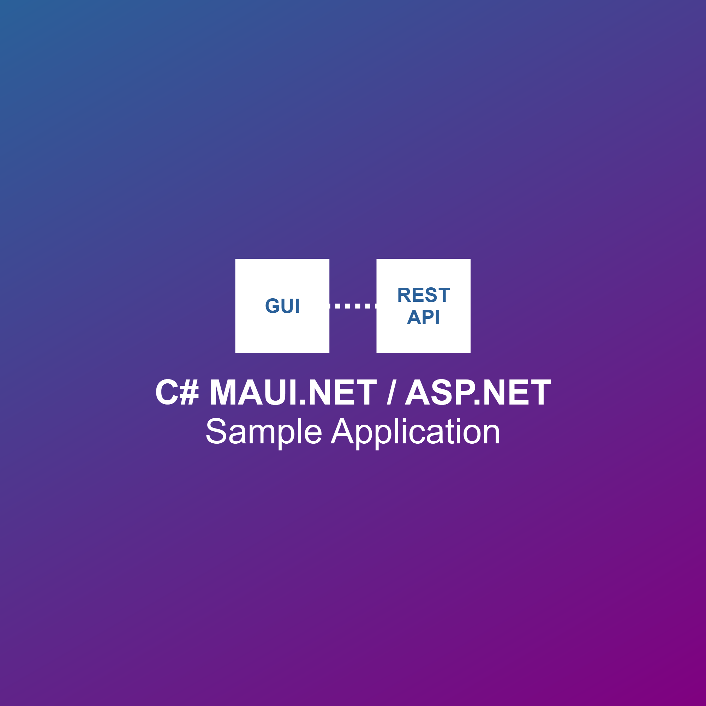

## Deck overview

- **Section 1 - Intended readers**
- **Section 2 - The software architecture**
- **Section 3 - The `CustomLib` component**
- **Section 4 - The `CustomApi` component**
- **Section 5 - The `CustomSdk` component**
- **Section 6 - The `CustomCli` component**
- **Section 7 - The `CustomApp` component**
- **Section 8 - Advanced topics**

---

<!-- _class: center dark -->

## Section 1 - Intended readers

Who should read this document and who should not read it.

---

### Intended reader overview

*Coming soon*

---

<!-- _class: center dark -->

## Section 2 - The software architecture

**Domain model** and **component model**

---

<!-- _class: center -->

### Domain model

The **entities**, their **attributes**, and their **relationships**

---

#### Domain model overview

The diagram on the right shows the **domain model** implemented by the application.

The data model consists of **three entities**, namely `User`, `Issue`, and `Comment`.

Issues and comments are `created by` users, comments are `contained in` issues.

---

#### The `User` entity

The `User` entity represents, as the name suggests, the users of the sample application.

For each user, **a first and a last name** must be defined, which are shown in the GUI.

Furthermore, each user has a unique **identifier** as well as create, update, and delete timestamps.

---

#### The `Issue` entity

The `Issue` entity represents problems with some machine reported by the users.

Each issue carries the identifier of the corresponding user as well as a **label** explaining the issue.

Also, each issue has a unique **identifier** as well as a create, update, and delete timestamp.

---

#### The `Comment` entity

Finally, the `Comment` entity represents, as the name suggests, comments associated to issues.

For each comment, the identifier of the corresponding user and a **text** is defined.

Moreover, each comment has a unique **identifier** as well as a create, update, and delete timestamp.

---

<!-- _class: center -->

### Component model

**Components** and their **dependencies / interactions**

---

### Component model overview

The sample application comprises **two library** and **three executable** components.

The **library components** include the `CustomLib` and the `CustomSdk` components.

The **executable components** include the `CustomApi`, the `CustomCli`, and the `CustomApp` components.

---

### The `CustomLib` component

The `CustomLib` component contains a common set of **classes and interfaces** for the other components.

Most importantly, it defines the **messages** exchanged between the backend and the frontends.

Furthermore, it defines the **contracts** between backend and frontends in the form of *regular interfaces*.

---

### The `CustomApi` component

The `CustomApi` component implements the **backend** of the sample application.

The backend is responsible for **managing and serving** the entity instances.

The backend services are exposed as **HTTP REST API** using the Microsoft ASP.NET framework.

---

### The `CustomSdk` component

The `CustomSdk` provides a set of classes for **interacting** with the `CustomApi`backend.

The interaction is realized by means of **HTTP REST API clients** producing and consuming messages.

These clients send **request messages** to the backend and the backend responds with **response messages**.

---

### The `CustomCli` component

The `CustomCli` component provides a **command line interface (CLI)** for the backend services.

CLIs represent the simplest form of application and are used, e.g., for **administration tasks**.

The implementation uses the clients of the `CustomSdk` to **access** the backend services.

---

### The `CustomApp` component

The `CustomApp` component provides a **graphical user interface (GUI)** for the sample application.

GUIs typically are shipped to the end **users of an application** and excel over CLIs in terms of usability.

The implementation is based in the **Microsoft MAUI.NET** cross-platform application framework.

---

<!-- _class: center dark -->

## Section 3 - The `CustomLib` component

**Models**, **interfaces**, and **exception handler**

---

<!-- _class: center -->

### HTTP request / response *body models*

**JSON-encoded** data exchange through **message bodies**

---

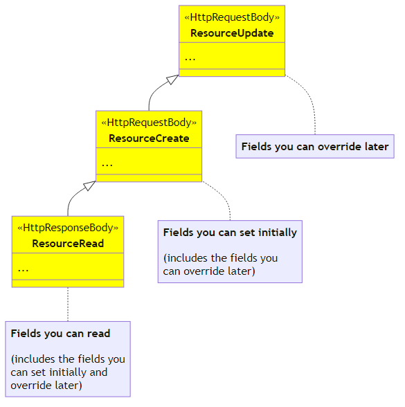

#### Generic message body model

The REST API uses request and response **messages** for managing the entities (also called *resources*).

For **each resource** (i.e. user, issue, comment) we distinguish `Read`, `Create`, and `Update` messages.

In the following, we describe each **type of message** in more detail including their data fields.

---

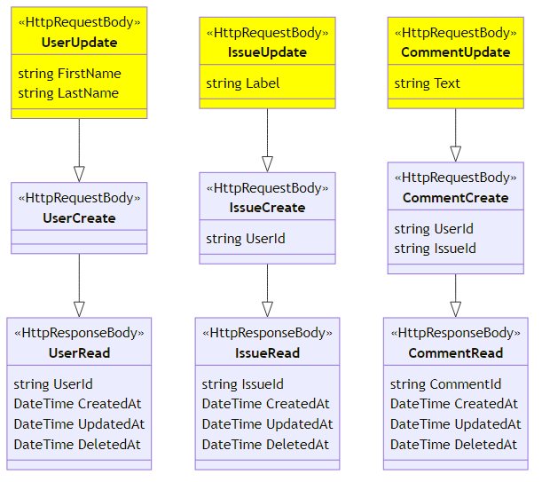

#### `Update` request body models

The `Update` messages contain the fields that you can **override later** after creating an instance.

For `User` entities, **the first and the last name** can be changed any time later.

For `Issue` entities, the **label** can be changed later, and for `Comment` entities the **text**.

---

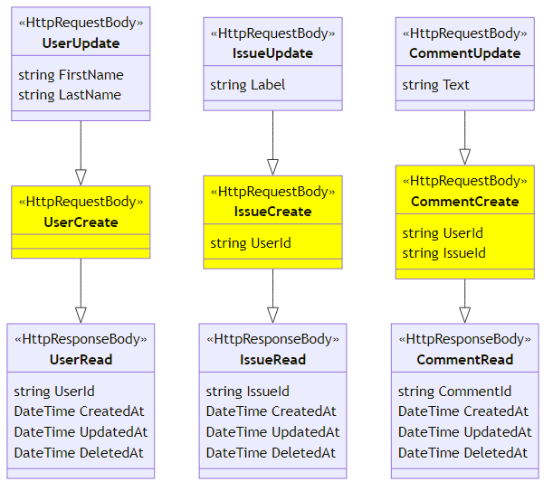

#### `Create` request body models

The `Create` messages derive from the `Update` messages and add the fields that you can **set initially only**.

For `Issue` entities you must define the identifier of the **user** who created the issue.

For `Comment` entities you must define the identifier of the **user** as well as the containing **issue**.

---

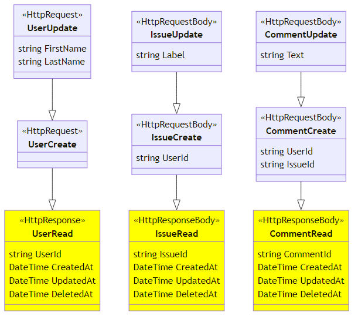

#### `Read` response body models

Finally, the `Read` messages derive from the `Create` messages and add the fields that are **read-only**.

For all entities the read-only fields include the **unique entity identifier** selected randomly on creation.

Furthermore, the read-only fields include **create, update, and delete timestamps** managed automatically.

---

<!-- _class: center -->

### HTTP request *query models*

**URL-encoded** data exchange through **query strings**

---

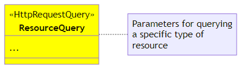

#### Generic request query model

In addition to the body models, the HTTP REST API uses so-called **query** models.

The query models define the parameters for **querying and filtering** the resources.

Again, we define **for each resource type** (i.e. user, issue, comment) an independent query model.

---

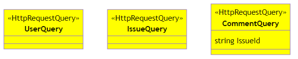

#### Concrete request query models

The diagram on the right shows the **query models** for the different entities of the system.

The query models for users and issues **do not provide** any special querying and filtering capabilities.

Only the query model for comments allows to filter the instances by **associated issue identifier**.

---

<!-- _class: center -->

### Abstract interface

**Resource-independent** method signatures

---

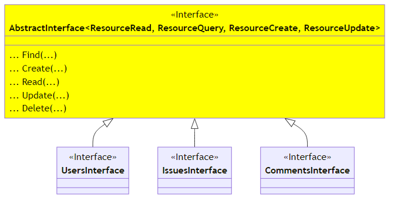

#### Abstract interface overview

Based on the previous body and query models we **define the methods** of the REST API.

We use a **generic interface** model including `Find`, `Create`, `Read`, `Update`, and `Delete` methods.

In the following, we explain each method **in more detail** including its inputs and outputs.

---

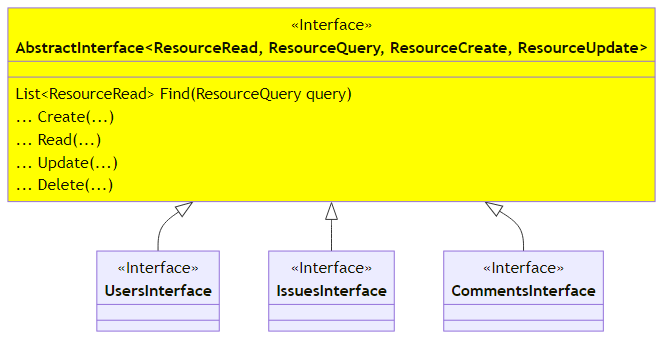

#### The `Find` method

The `Find` method returns a **collection** of created (and *not* deleted) instances.

The method receives parameters for **filtering** through the respective `Query` model.

The method returns a list of the **matching instances** encoded using the respective `Read` model.

---

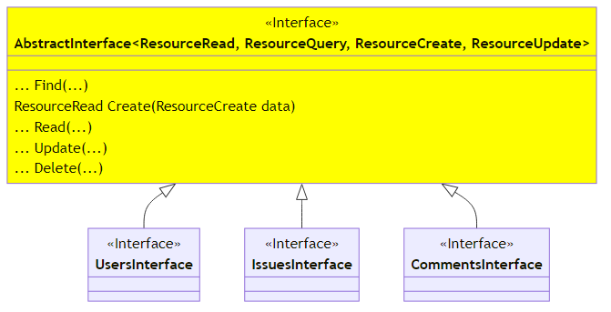

#### The `Create` method

The `Create` method **creates and returns** new instances of a given entity type.

The **input parameters** use the corresponding `Create` model defined previously.

The **return type** corresponds to the respective `Read` model from before.

---

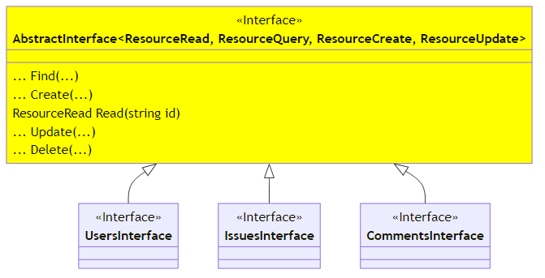

#### The `Read` method

The `Read` method **returns** an existing instance with a given identifier.

The **single input parameter** represents the identifier of the desired instance.

The **return type** corresponds to the respective `Read` model from before.

---

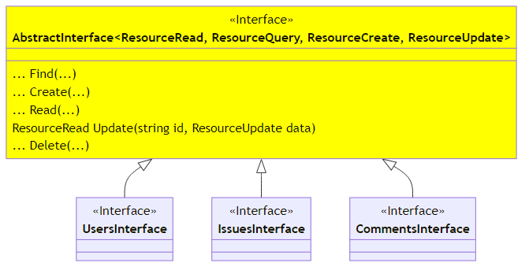

#### The `Update` method

The `Update` method **overrides and returns** an existing instance with a given identifier.

The **two input parameters** are the identifier of the instance and the respective `Update` model.

The **return type** corresponds to the respective `Read` model as introduced before.

---

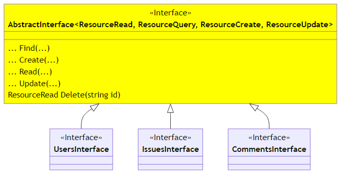

#### The `Delete` method

Finally, the `Delete` method **deletes and returns** an existing instance with a given identifier.

The **single input parameter** represents the identifier of the instance that shall be deleted.

The **return type** again corresponds to the `Read` model of the corresponding resource type.

---

<!-- _class: center -->

### Concrete interfaces

**Resource-dependent** method signatures

---

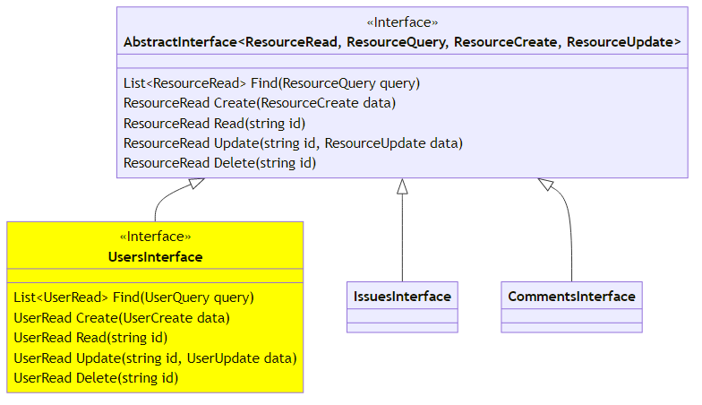

#### The users interface

The diagram on the ride side shows the **concrete interface** for managing `User` entities.

The type parameters `ResourceRead` and `ResourceQuery` **are replaced** with `UserRead` and `UserQuery`.

Also, `ResourceCreate` and `ResourceUpdate` **are substituted** with `UserCreate` and `UserUpdate`.

---

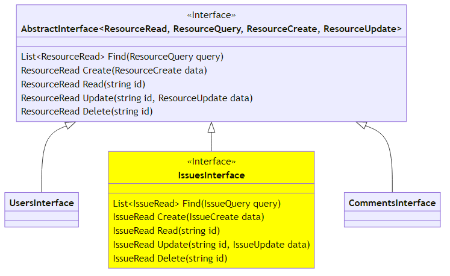

#### The issues interface

The diagram on the ride side shows the **concrete interface** for managing `Issue` entities.

The type parameters `ResourceRead` and `ResourceQuery` **are replaced** with `IssueRead` and `IssueQuery`.

Also, `ResourceCreate` and `ResourceUpdate` **are substituted** with `IssueCreate` and `IssueUpdate`.

---

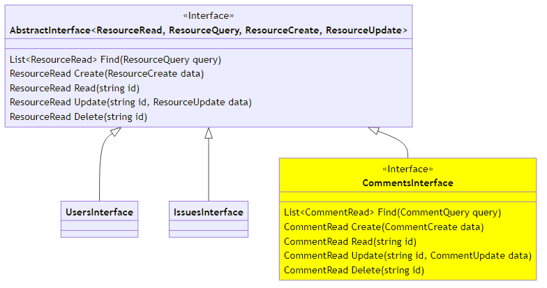

#### The comments interface

The diagram on the ride side shows the **concrete interface** for managing `Comment` entities.

The parameters `ResourceRead` and `ResourceQuery` **are replaced** with `CommentRead` and `CommentQuery`.

Also, `ResourceCreate` and `ResourceUpdate` **are substituted** with `CommentCreate` and `CommentUpdate`.

---

<!-- _class: center -->

### Exceptions

**Potential problems** during method execution

---

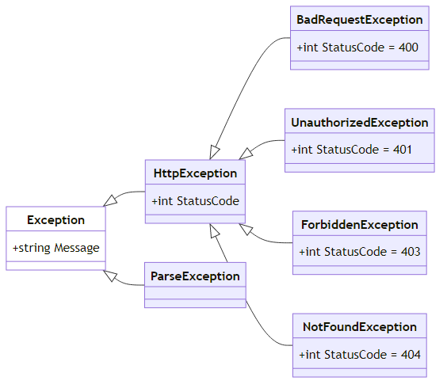

#### Exception overview

Under some circumstances, the interface methods **cannot** execute successfully.

If such circumstances occur, the methods **throw** one of the exceptions shown on the right side.

In the sample application we distinguish two exception types:  **HTTP** and **parse exceptions**.

---

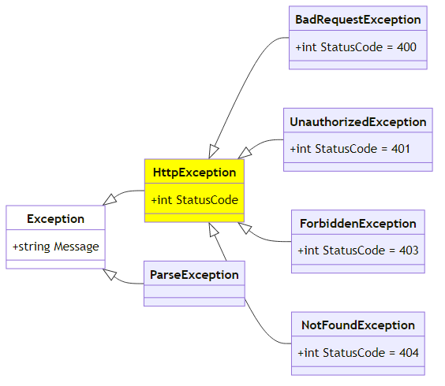

#### HTTP exceptions

HTTP exceptions indicate that the method **could not** be executed successfully.

There are different reasons why **method execution** might not have been successful.

In the HTTP protocol and HTTP REST APIs, the reasons are **differentiated** by means of *status codes*.

---

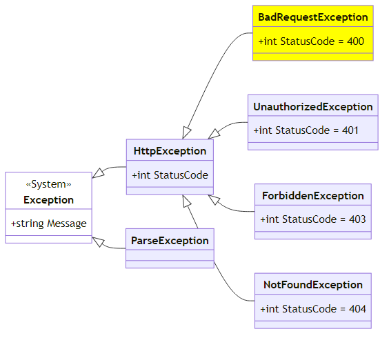

#### Bad request exceptions

The first possible reason is called **bad request** and comes with a status code of `400`.

Bad request exceptions indicate an **issue** with the **HTTP request message** sent to the backend.

For example, the request message might **miss mandatory parameters** for method execution.

---

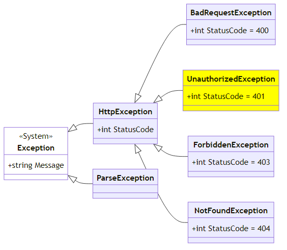

#### Unauthorized exceptions

The second possible reason is that the caller **has not provided** authorization information.

Typically, backend methods can only be executed by users, which have **registered and signed in**.

If an adequate authorization proof is missing, the backend will answer with **unauthorized status** `401`.

---

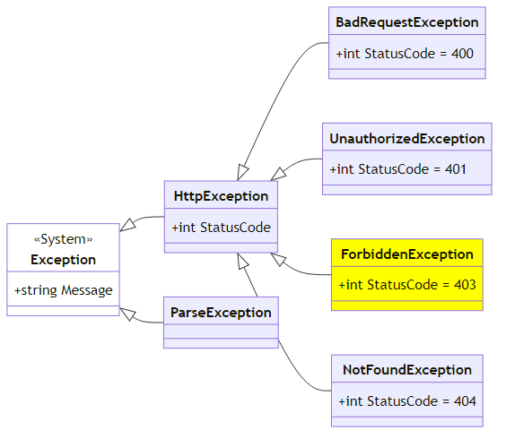

#### Forbidden exceptions

The third possible reason is that the caller has authorized, but does not have the **necessary permissions**.

For example, a registered and signed in user **should not be allowed** to change other user profiles.

If such request is received by the backend, it will answer with the **forbidden status** `403`.

---

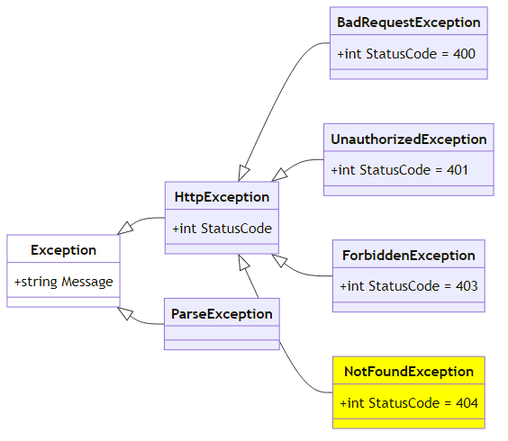

#### Not found exceptions

The fourth possible reason is that the user tries to **access an entity** which does not exist.

For example, the user might want to update an entity which has been **deleted in the meantime**.

In such cases the backend will respond with the **not found status code** `404`.

---

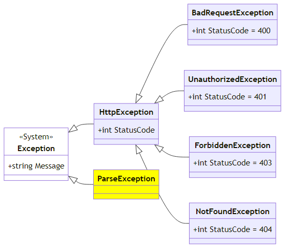

#### Parse exceptions

Even if none of the previous exceptions occur, **another kind** of problem might arise.

In the sample application all interface methods are **expected to consume and produce** JSON encoded data.

If the JSON parser **fails to decode** a message, a parse exception will be thrown.

---

<!-- _class: center dark -->

## Section 4 - The `CustomApi` component

**Managers**,  **controllers**, and **handlers**

---

<!-- _class: center -->

### Managers

A **simple main-memory storage** for the entities.

---

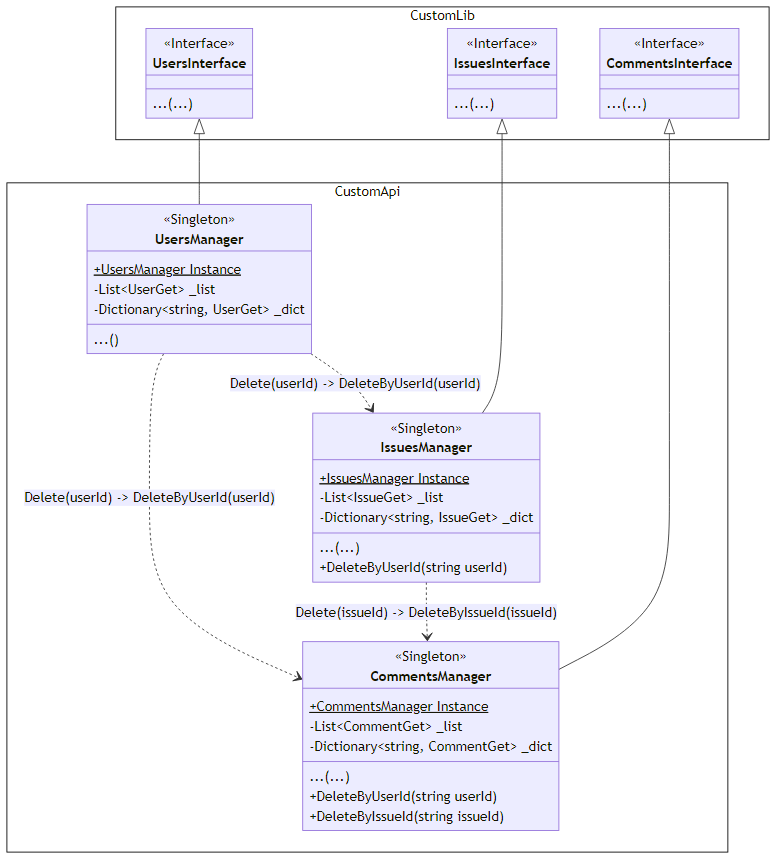

### Manager overview

In the `CustomApi` component, the **managers** are responsible for storing, updating, and querying the entities.

For overall **type safety**, the managers implement the interfaces of the `CustomLib`component.

Furthermore, the manager implementations are based on the **singleton design pattern**.

---

### Manager overview (cont'd)

Internally, the managers **maintain their instances** using both a `List` and a `Dictionary` data structure.

The `List` data structure simply stores all instances in a **flat sequence**, which can be iterated easily.

The `Dictionary` data structure instead supports quick access by **instance identifier**.

---

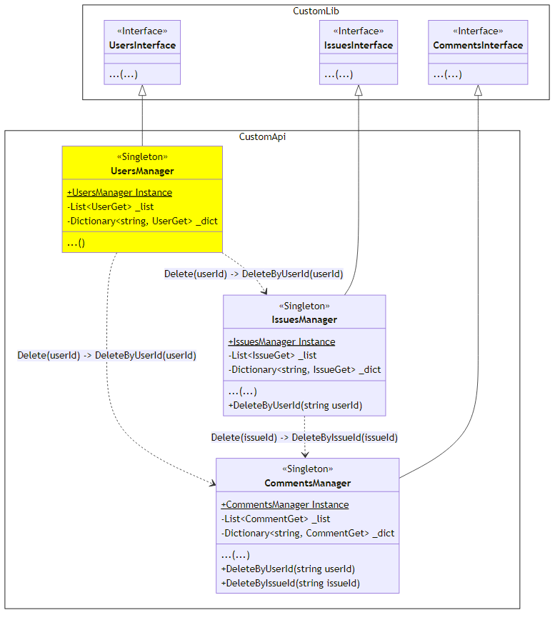

### The `UsersManager` singleton

The `UsersManager` is responsible for managing the **users** of the sample application.

User **find, create, read, and update operations** are managed completely *internally*.

User **delete operations** are forwarded to the `IssuesManager` and the `CommentsManager` recursively.

---

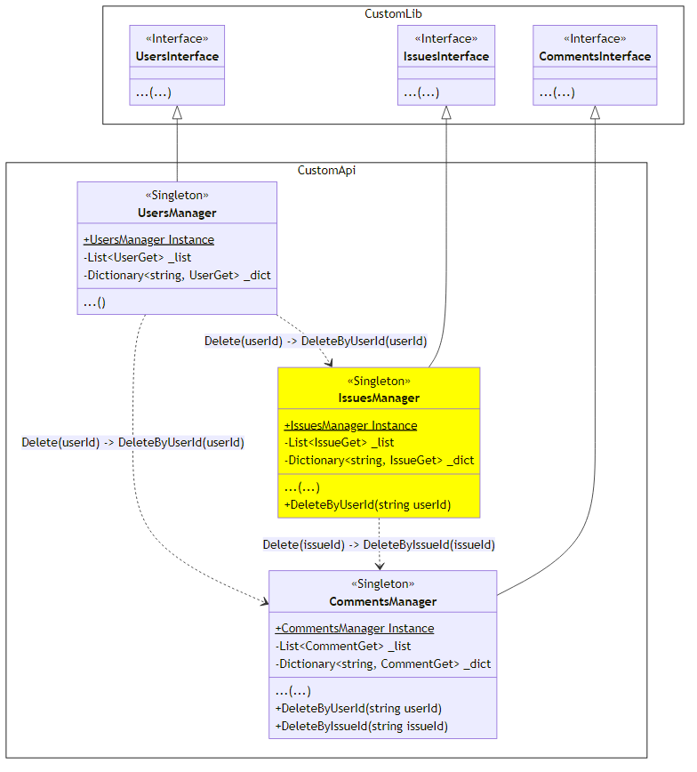

### The `IssuesManager` singleton

The `IssuesManager` is responsible for managing the **issues** of the sample application.

Issue **find, create, read, and update operations** again are managed completely *internally*.

And issue **delete operations** are forwarded to the `CommentsManager` recursively.

---

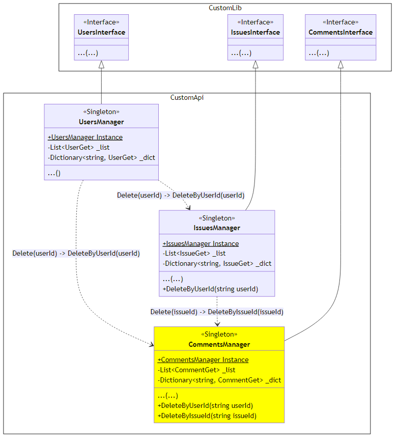

### The `CommentsManager` singleton

The `CommentsManager` is responsible for managing the **comments** of the sample application.

Comment **find, create, read, and update operations** again are managed completely *internally*.

Also comment **delete operations** *must not be forwarded* recursively and can be managed internally.

---

<!-- _class: center -->

### Controllers

**Binding** *interface methods* to *HTTP REST API endpoints*.

---

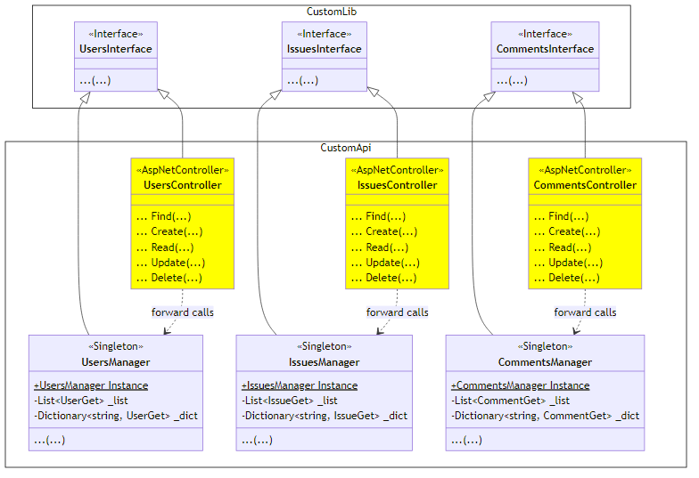

#### Controller overview

In the Microsoft ASP.NET framework, **annotated controller classes** define the endpoints of the HTTP REST API.

In the sample application, we define one controller class **for each resource type** (i.e. user, issue, comment).

The controllers essentially just **forward the method calls** to the respective *manager singletons*.

---

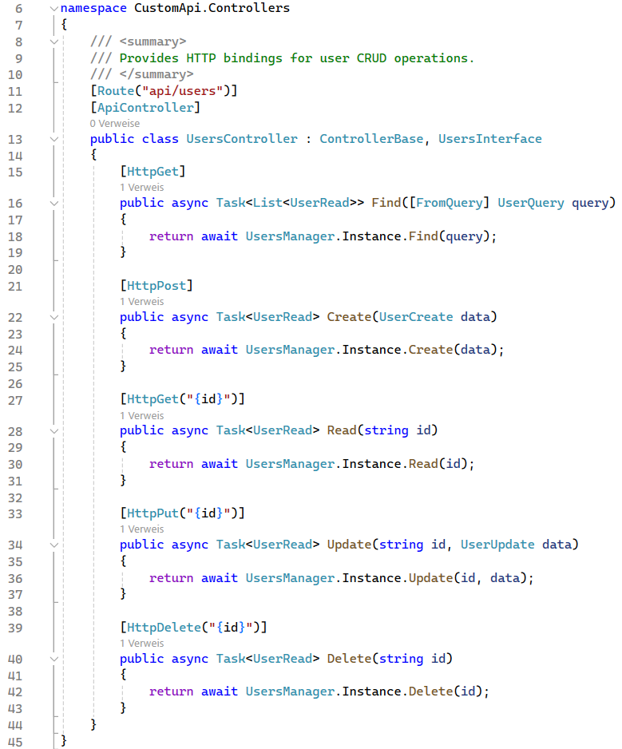

#### The `UserController` class

The screenshot on the right shows the **source code** of the annotated `UserController` class.

The class-level annotation `[ApiController]` indicates that the class **can handle HTTP requests**.

The class-level annotation `[Route]` indicates which **request paths** the class wants to handle.

---

#### HTTP request method binding

Then, note the **method-level annotations** `[HttpGet]`, `[HttpPost]`, `[HttpPut]`, and `[HttpDelete]`.

These annotations define the binding from **HTTP methods** (`GET`, `POST`, `PUT`, `DELETE`) to controller methods.

For example, `HTTP GET <path>` requests are only forwarded to methods with `HttpGet` annotation.

---

#### HTTP request path binding

The previous annotations also support **path to method** and **path segment to parameter** bindings.

E.g., `HTTP GET /api/users` results in the method call `Find(...)` with pure *path to method binding*.

And `HTTP GET /api/users/xyz` results in the method call `Get("xyz")` with *path segment to parameter binding*.

---

#### HTTP request query string binding

The **parameter-level annotation** `[FromQuery]` indicates a query string to parameter binding.

Query strings can be **appended** to HTTP request paths using the syntax `HTTP GET <path>?<queryString>`.

ASP.NET automatically parses the query strings into the `Query` models introduced previously.

---

#### HTTP request body binding

Then, ASP.NET automatically binds the **JSON-encoded bodies** of HTTP requests to method parameters.

E.g., for `HTTP POST /api/users` requests the request body is turned into a `UserCreate` instance.

And for `HTTP PUT /api/users/xyz` requests the request body is parsed into a `UserUpdate` instance.

---

#### HTTP response body binding

Finally, ASP.NET also automatically translates the **return values** to JSON encoded bodies of HTTP responses.

E.g., for `HTTP GET /api/users` requests the response body contains a **JSON array** of user data.

And for `HTTP GET /api/users/xyz` requests the response body contains a **single JSON object** of user data.

---

<!-- _class: hide-header hide-footer hide-page-number -->

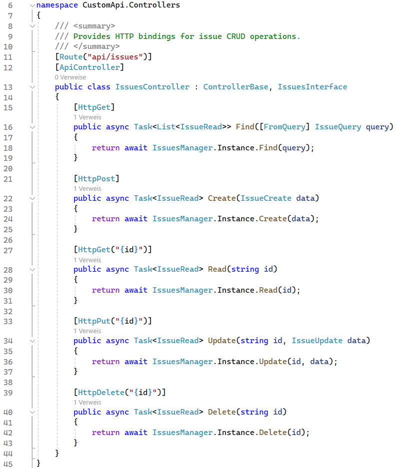
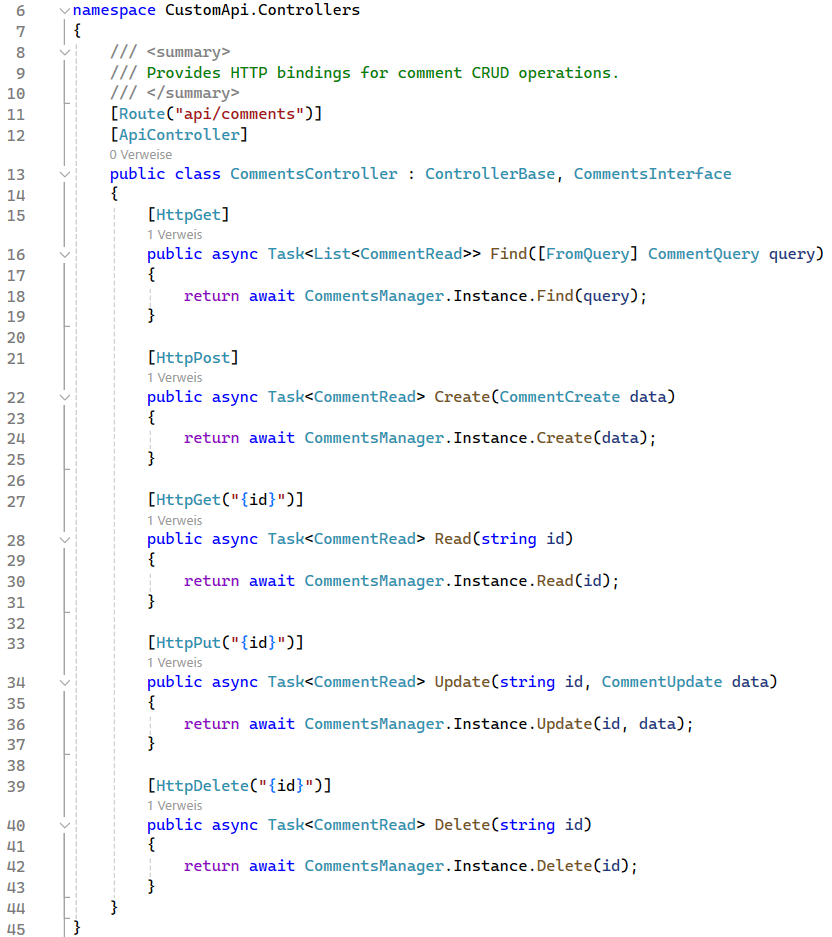

---

### The Swagger UI

ASP.NET can build a so-called **Swagger UI** from your annotated controller classes automatically.

In **debug mode**, the Swagger UI will open in the browser when you run an ASP.NET project.

The Swagger UI can be used for **documentation** as well as for **testing** of HTTP REST APIs.

---

<!-- _class: center -->

### Exception handler

**Binding** *exceptions* to *HTTP response status codes*

---

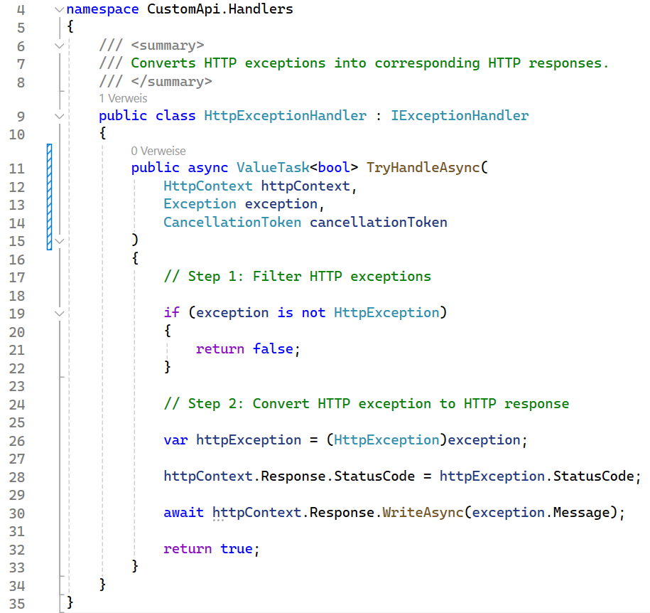

### Custom exception handler class

Under certain circumstances, the managers **might throw** one of the exceptions introduced previously.

These exceptions must be **translated** into corresponding **HTTP response messages and status codes**.

To achieve such translation, we must define a **custom exception handler** as shown on the right.

---

### Exception type filtering

When an exception occurs **during controller method execution**, the exception handlers are invoked.

Each exception handler can decide, **whether to process the exception or pass it on** to the next handler.

Note that our custom exception handler **only processes instances** of our own `HttpException` class.

---

### HTTP response definition

Instances of the `HttpException` class carry a **status code** (between `400` and `404`) and a **message** string.

Both the status code and the message values of the exception are **transferred** to the HTTP response.

Note that this implementation also works if we **introduce additional** `HttpException` sub-classes.

---

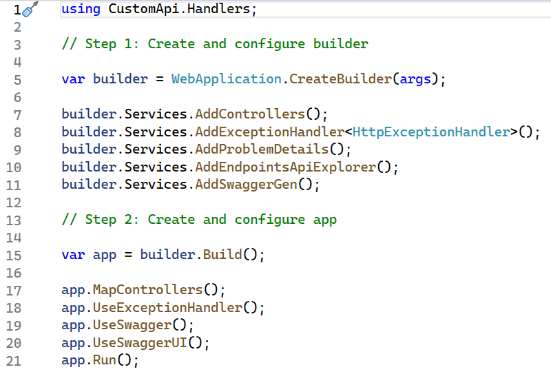

### Exception handler registration

Finally, we need to **register our custom exception** handler in the ASP.NET framework.

The code on the right shows a **working solution** with a custom exception handler class.

We need to add **lines 8 and 9** as well as **line 18** for the custom exception handler to work properly.

---

<!-- _class: center dark -->

## Section 5 - The `CustomSdk` component

**Abstract client class** and **concrete client classes**

---

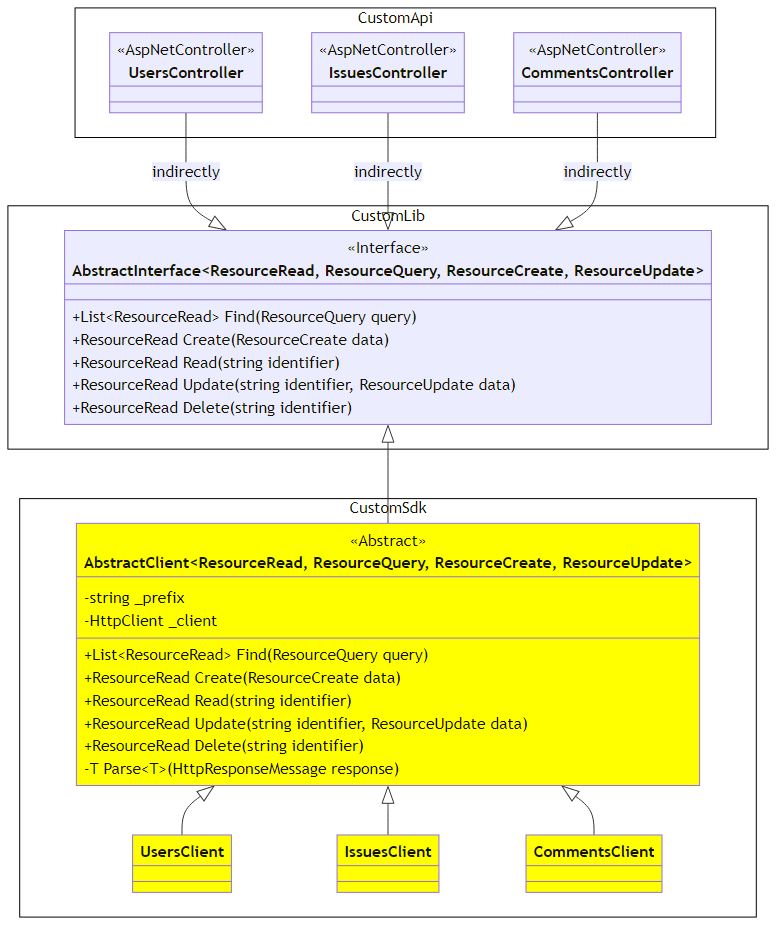

#### Backend service clients

So-called clients are used to **access the backend services** through HTTP message exchange.

**For our resources** we provide the `UsersClient`, the `IssuesClient`, and the `CommentsClient` classes.

Their implementation, however, can be **generalized** almost entirely in the `AbstractClient` class.

---

<!-- _class: center -->

### Abstract client class

Common HTTP request and response **message patterns**

---

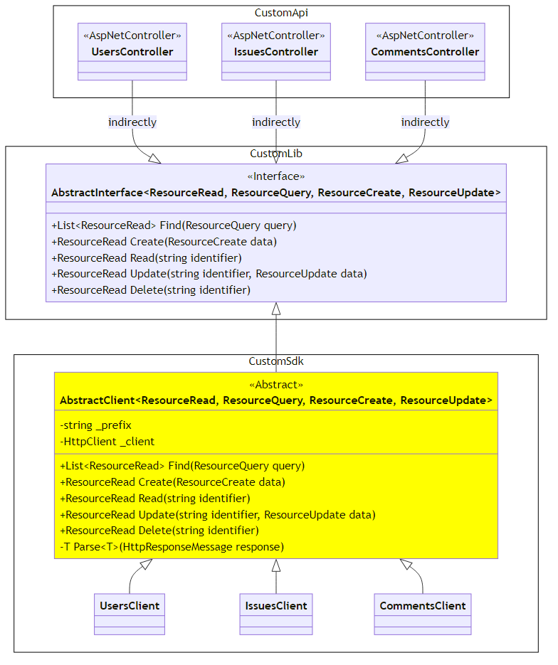

#### The `AbstractClient` class

The `AbstractClient` class **implements** the `AbstractInterface` from the `CustomLib` component.

Note that also the **controllers** of the `CustomApi` component implement this interface.

Hence, the interface serves as the **contract** between the backend services and the clients.

---

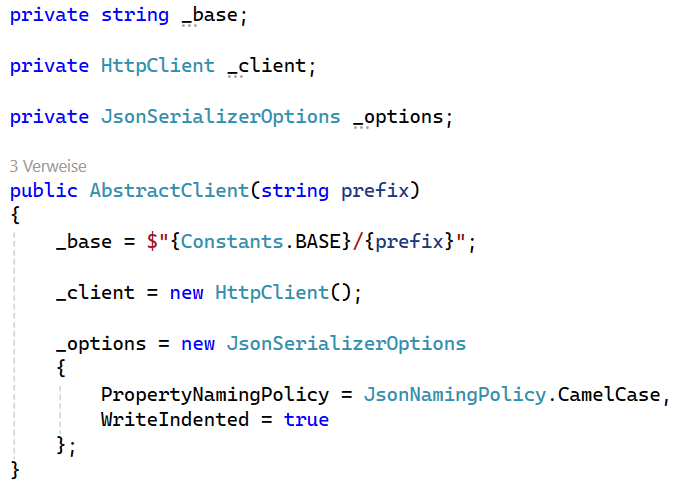

#### The public constructor

The `AbstractClient` class provides a constructor, which accepts a **resource-dependent path prefix**.

The path prefix is used to build the URLs for **calling the user, issue, and comment backend services**.

The constructor also **creates** a `System.Net.HttpClient` instance and defines JSON serialization options.

---

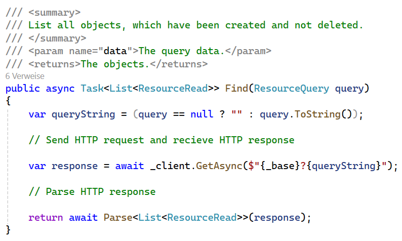

#### The public `Find` method

The screenshot on the right shows the **generic implementation** of the `Find` method.

First, the `Query` model is **converted** into a *URL-encoded* query string before **sending** an `HTTP GET` request.

Finally, the HTTP response is **received and parsed** into a list structure of `ResourceRead` objects.

---

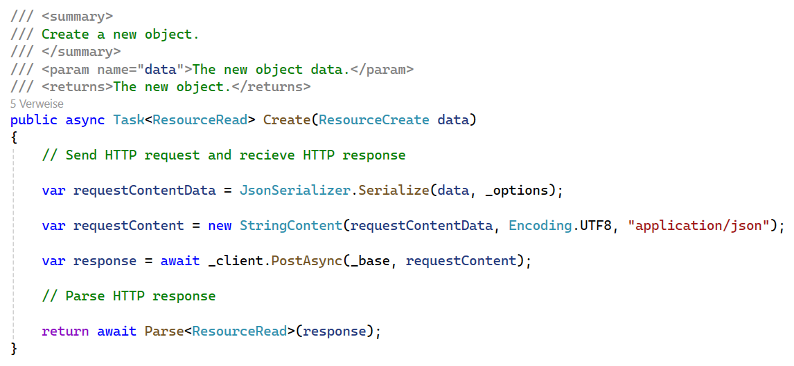

#### The public `Create` method

The next screenshot shows the **generic implementation** of the `Create` method.

First, the `Create` model is **serialized to JSON** before sending the respective `HTTP POST` request.

Then, again the HTTP response is **received and parsed** into a single `ResourceRead` object.

---

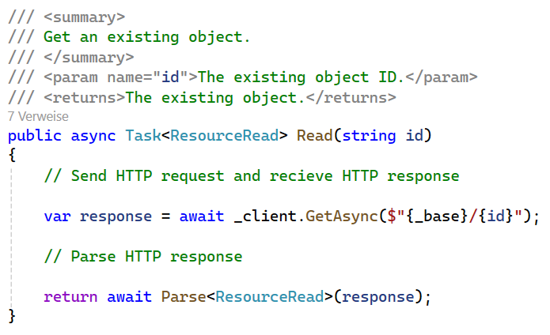

#### The public `Read` method

Now we come to the **generic implementation** of the `Read` method.

The implementation **must not do** any preparatory work, but can send the `HTTP GET` request directly.

As before, the HTTP response is **received and parsed** into a single `ResourceRead` instance.

---

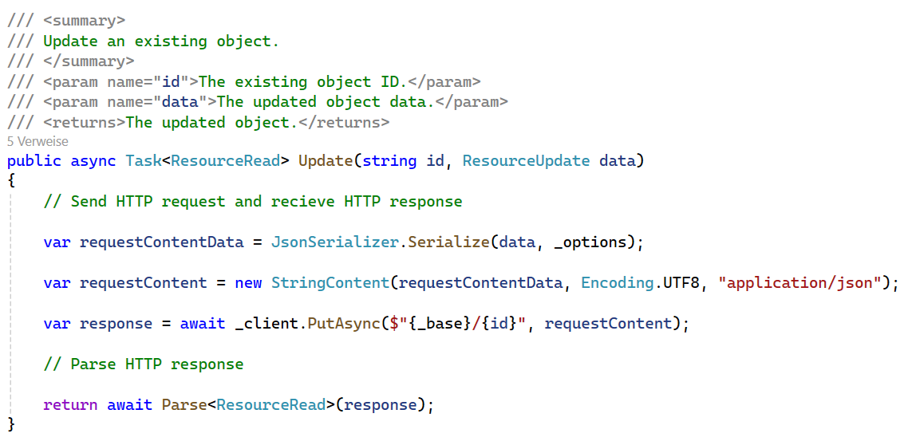

#### The public `Update` method

Next, the screenshot on the right shows the **generic implementation** of the `Update` method.

Here the `Update` model is first **serialized to JSON** before sending an `HTTP PUT` request to the backend.

As expected, the HTTP response is **received and parsed** into a single `ResourceRead` object.

---

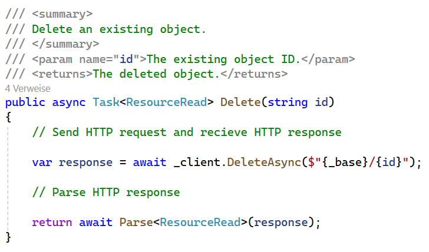

#### The public `Delete` method

Finally, the screenshot on the right shows the **generic implementation** of the `Delete` method.

The implemenation also **does not require** any preparation before sending an `HTTP DELETE` request.

As before, the HTTP response is **received and parsed** again into a single `ResourceRead` instance.

---

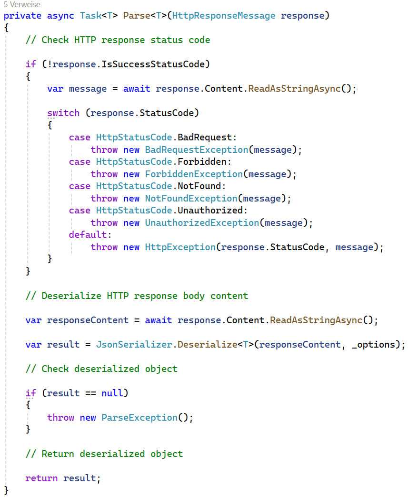

#### The private `Parse` method

The last screenshot shows the **generic implemenation** of the `Parse` method.

The method first **checks the HTTP response status code** and throws an `HttpException` if necessary.

Then, the **HTTP response body** is JSON-deserialized into the target type with optional `ParseException`.

---

<!-- _class: center -->

### Concrete client classes

Concrete **resource type** and **prefix definition**

---

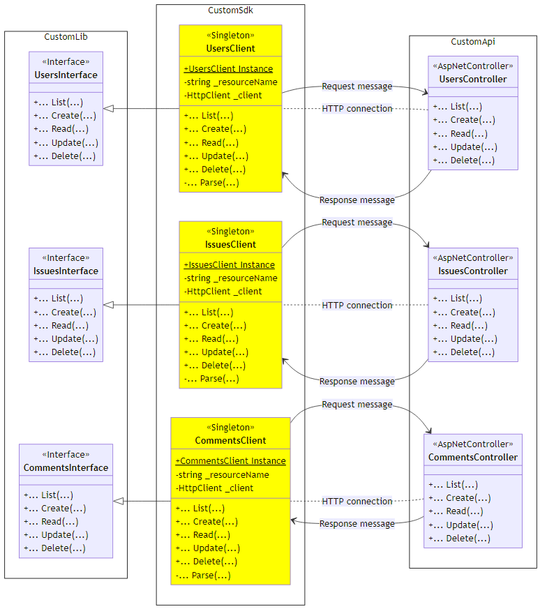

#### Concrete client classes

The diagram on the right shows the **contrete classes** derived from the `AbstractClient` class.

Note that these clients implement the **resource-specific interfaces** with their *body and query models*.

Also note that the client classes make use of the **well-known singleton** design pattern.

---

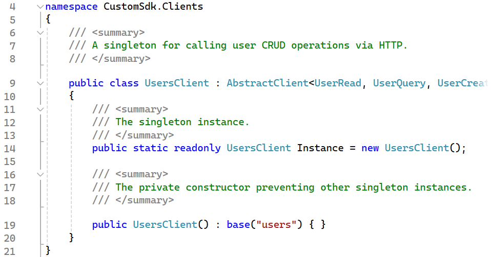

#### The `UsersClient` class

The screenshot on the right shows the **definition** of the `UsersClient` class.

As **type parameters** we choose the `UserRead`, `UserCreate`, `UserUpdate`, and `UserQuery` classes in *line 9*.

Consequently, the client **serializes** user `Create`, `Update`, and `Query` and **deserializes** user `Read` models.

---

#### The resource name string

Then, the `UsersClient` class needs to tell the `AbstractClient` constructor the **name of the requested resource**.

The `AbstractClient` uses the passed resource name `"users"` (see *line 19*) to **build URLs** for HTTP requests.

For the `UsersClient` class, the `AbstractClient` **derives** this URL: `http://localhost:5252/api/users`.

---

#### The singleton instance

Finally, to **provide quick access** to client instances, we use the singleton design pattern here.

The singleton design pattern requires the **constructors** of the class to be **private** only (see *line 19*).

Furthermore, a single instance must be provided through a **static field or method** (see *line 14*).

---

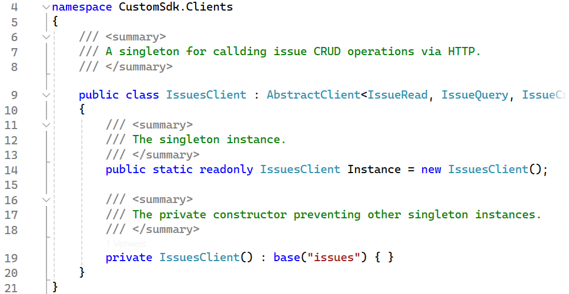
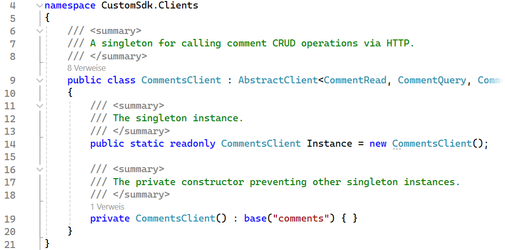

---

<!-- _class: center dark -->

## Section 6 - The `CustomCli` component

**Program class** and **commands**

---

<!-- _class: center -->

### Program class

The entry point for **CLI execution**

----

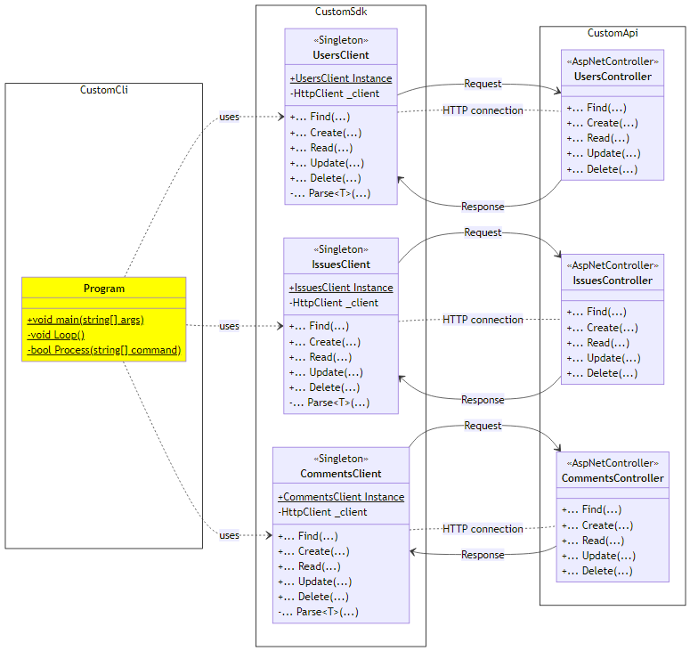

#### The `Program` class

The `CustomCli` component contains the `Program` class with a **static main method** as execution entrypoint.

The `Program` can read **commands** either from the *program arguments* or in **loop mode** from *standard input*.

The static method `Loop` **realizes** the loop mode, the static method `Process` **processes** the commands.

----

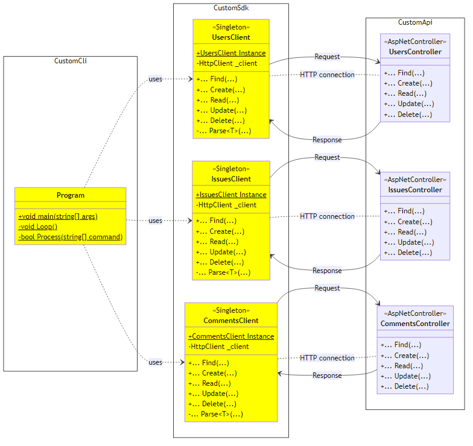

#### The `CustomSdk` dependency

The implementation of the `Program` class **depends** on the *client classes* in the `CustomSdk` component.

The `Program` uses the clients to **send requests** to the backend services and **receive responses**.

Note that the `CustomCli` component **must not need to know** the details of the required service communication.

---

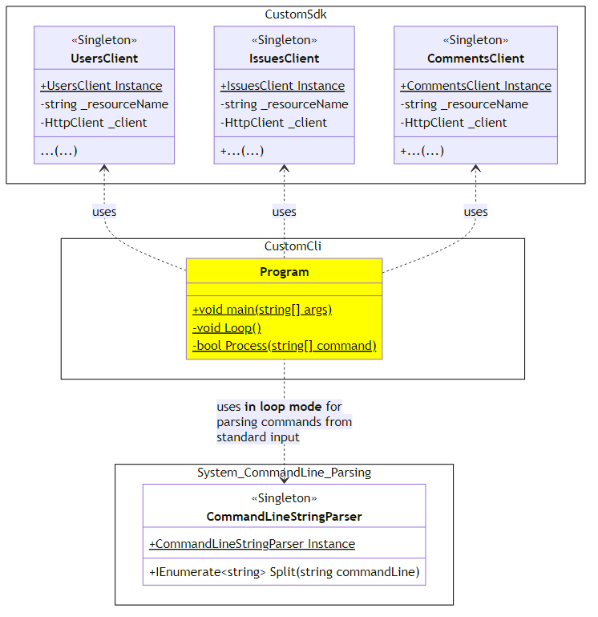

#### The `CommandLine` dependnecy

**Program arguments** are parsed automatically into corresponding string arrays.

When reading command lines from **standard input**, you need to do this conversion *manually*.

Microsoft provides the **NuGet package** `System.CommandLine` to handle this task reliably for you.

---

<!-- _class: center -->

### Commands

**Functionalities** provided to the end users

---

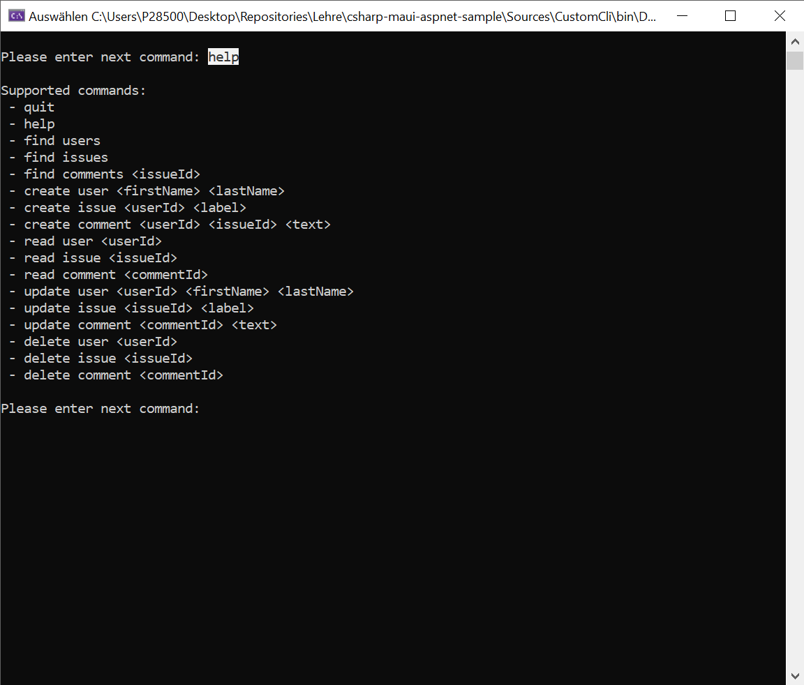

#### The `help` command

The **first command** offered by the `CustomCli` component to end users is the `help` command.

When executed, the `help` command **prints an overview** of all the supported commands.

For each command also the **list of parameters** is printed out, e.g., `delete comment <commentId>`.

---

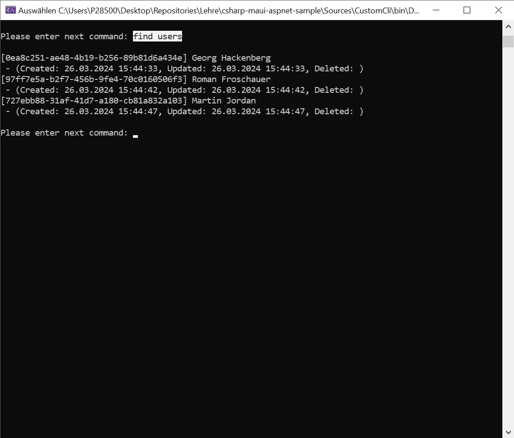

#### The `find users` command

The **next command** of the `CustomCli` discussed here is the `find users` command.

The `find users` command is also the first command **using the clients** of the `CustomSdk`.

When executed, the program **requests the list of users** from the backend and prints the result.

---

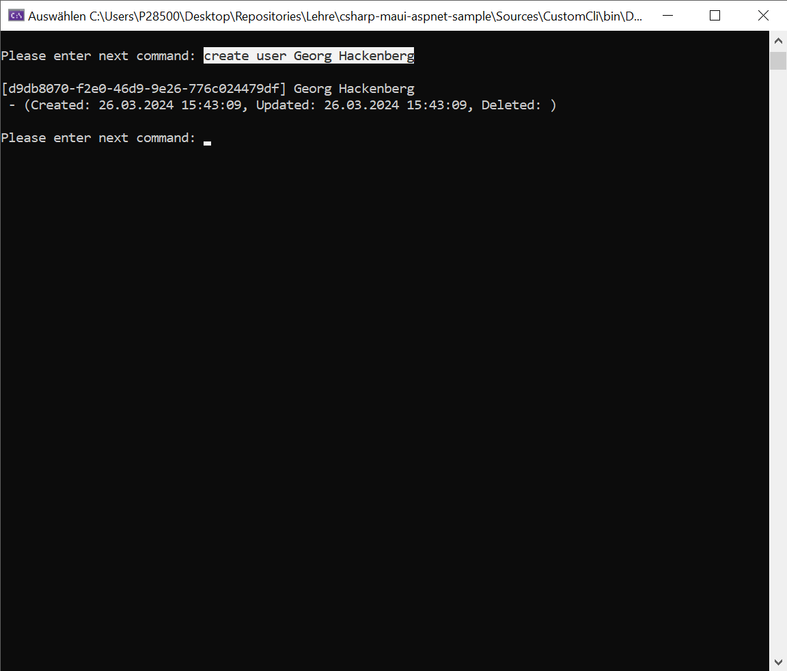

#### The `create user` command

Then, the `CustomCli` component offers the `create user` command for **creating new user objects**.

The command takes **two string arguments**: the `<firstName>` and the `<lastName>` of the new user.

When executed, the program **requests user creation** from the backend and prints the result.

---

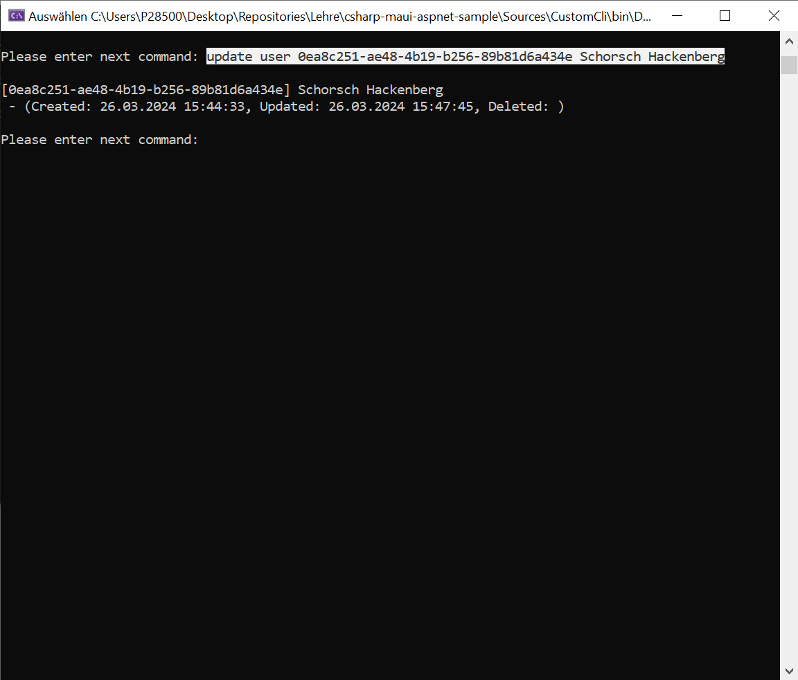

#### The `update user` command

Additionally, the `CustomCli` component offers the `update user` command for **changing user data**.

The command **takes as arguments** the `<userId>` as well as the new `<firstName>` and `<lastName>`.

Upon execution the program **requests a user update** and prints the results of the operation.

---

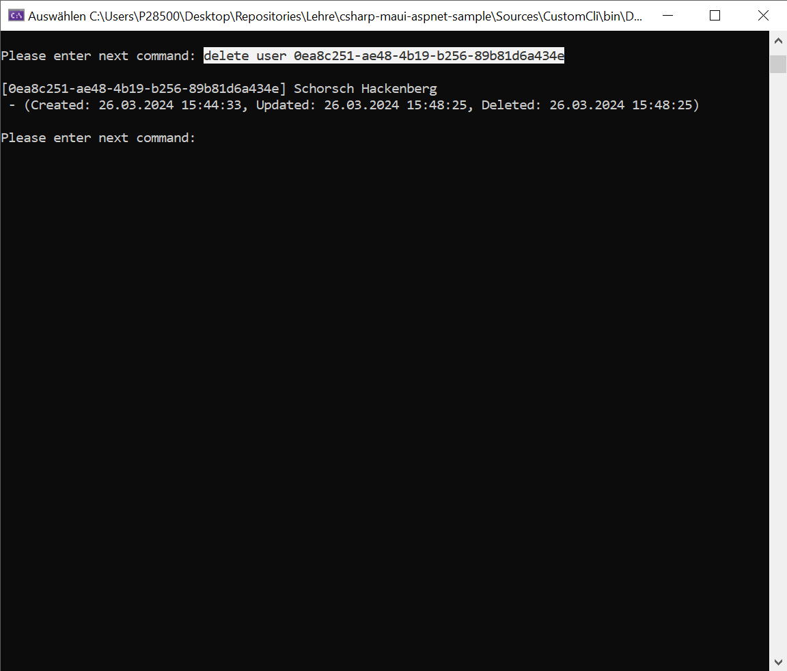

#### The `delete user` command

Finally, the `CustomCli` component also offers a `delete user` command for **deleting user objects**.

The command takes only a **single string argument**, namely the `<userId>` of the user object.

When executed, the program **request user deletion** from the backend and prints the result of the operation.

---

#### `Issue` resource commands

- `find issues` requests the list of issues created (and not deleted) and prints the result of the operation
- `create issue <userId> <label>` requests the creation of a new issue with a given label and associated to an existing user
- `read issue <issueId>` simply requests the data of an existing issue and prints it to standard output
- `update issue <issueId> <label>` requests the update of an existing issue with a given identifier and a new label
- `delete issue <issueId>` requests the deletion of an existing issue and prints the result to standard output

---

#### `Comment` resource commands

- `find comments <issueId>` requests the list of comments for a given issue identifier and prints the result
- `create comment <userId> <issueId> <text>` requests the creation of a new comment with a given text and associated with an existing user and issue
- `read comment <commentId>` simply requests the data of an existing comment and prints it to standard output
- `update comment <commentId> <text>` request the update of an existing comment with a given identifier and a new text
- `delete comment <commentId>` requests the deletion of an existing comment with a given identifier and prints the result

---

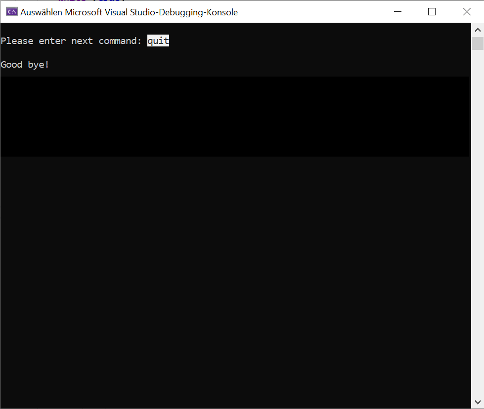

#### The `quit` command

When running in **loop mode**, the CLI will ask for new commands until the user send the command `quit`.

When sending this command, the CLI will **print the message** `Good bye!` and terminate the program.

Note that when **not running** in loop mode, this command also prints the message before terminating.

---

<!-- _class: center dark -->

## Section 7 - The `CustomApp` component

**Pages**, **page models**, and **page controllers**

---

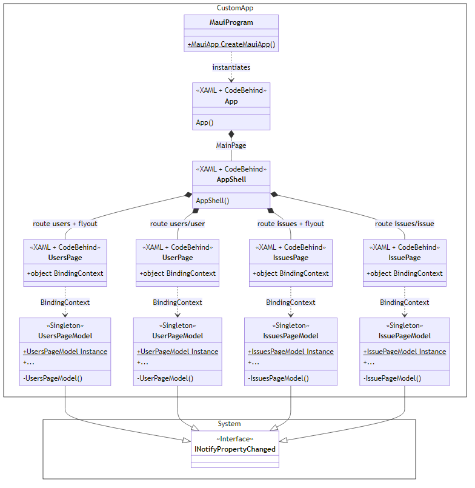

### High-level technical overview

The diagram on the right provides a **high-level technical overview** of the `CustomApp` component.

At its top you find **three core classes**, namely the `MauiProgram`, the `App`, and the `AppShell`.

Below you find the **page and page controller classes** as well as the **page model classes**.

---

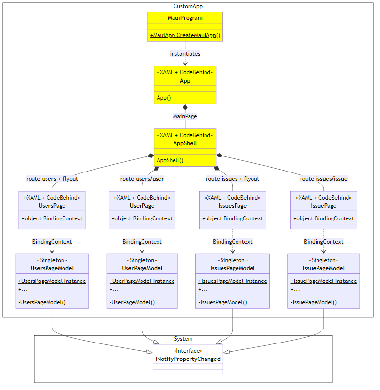

### Core classes

The `MauiProgram` class is responsible, e.g., for **configuring fonts** and **starting the application**.

The `App` class is responsible for **loading resource files** (e.g. for *colors* and *styles*) and **starting the shell**.

Finally, the `AppShell` class is responsible for **showing the window** and **handling page navigation**.

---

### Page and page controller classes

The page and page controller classes are split into a **XAML file** and a **code-behind C# file**.

The XAML file defines the **structure** of the view and **layout properties** of view elements (also called *controls*).

The code-behind C# file provides **callback functions for events** such as *button click*, *list select*, etc.

---

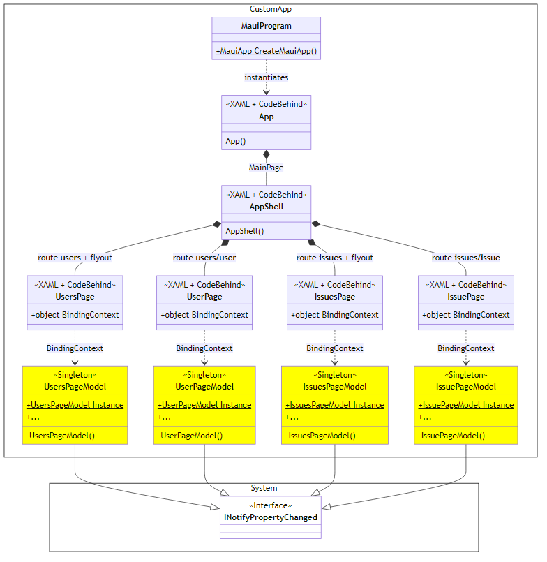

### Page model classes

The data of pages is managed in **underlying page models** with property change notifications.

Upon data changes, the page models fire **property change events**, which trigger page re-rendering.

Pages and page controllers **refer to their page models** by means of the `BindingContext` property.

---

<!-- _class: center -->

### Pages

The main **structural element** for building GUIs.

---

#### The users page

The users page is responsible for requesting the **user list** from the backend and showing it on screen.

On the top the page provides a **button** for reloading the list and on the bottom for creating a new user.

In the center, the page shows the **actual list** of users including their first and last names.

---

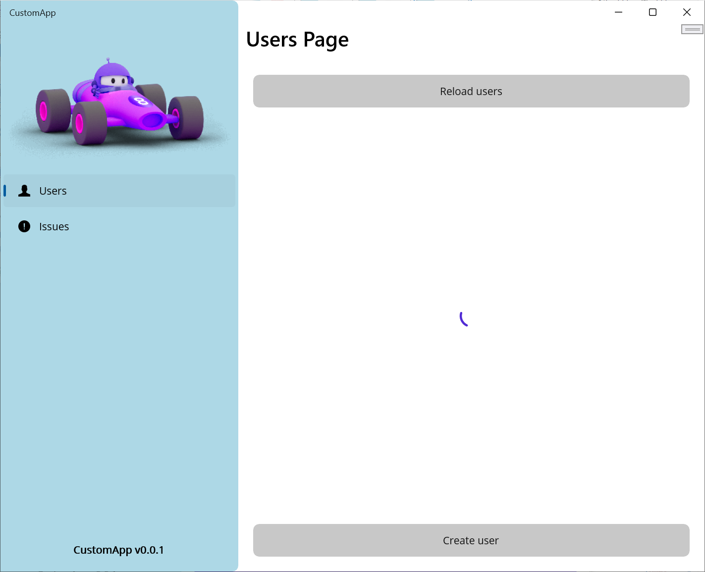

#### The users page in *load state*

When entering the page for the **first time** or clicking the **reload button**, the page turns into load state.

In load state the two buttons are **disabled**, which turns their background color into gray.

Furthermore, the list is hidden and instead an **activity indicator** is shown in the center of the page.

---

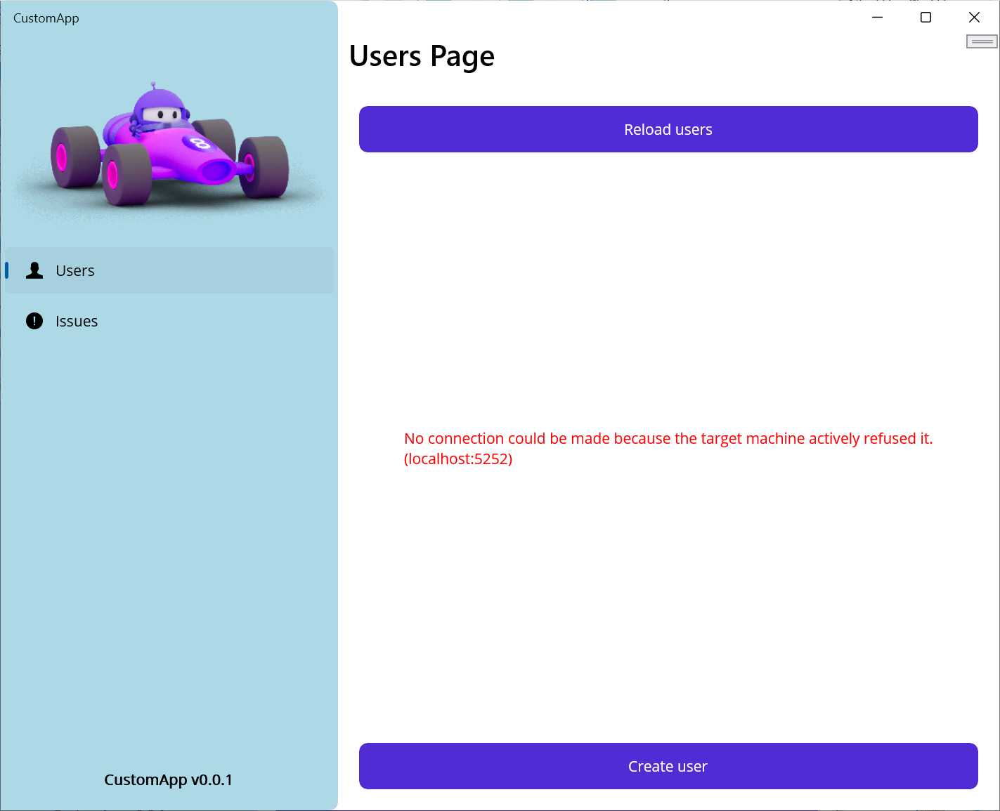

#### The users page in *error state*

During reload an error might occur for **several reasons** (e.g. the backend being down).

In such cases the page turns into **error state** as shown in the right screenshot.

In this state the buttons are enabled again and an **error message** is displayed in the center of the page.

---

#### The user page

When clicking an existing user or creating a new user, you enter the so-called **user page**.

The user page shows all the **data associated** with the existing or new user entity.

You can change the **first and last name**, the other fields are set automatically.

---

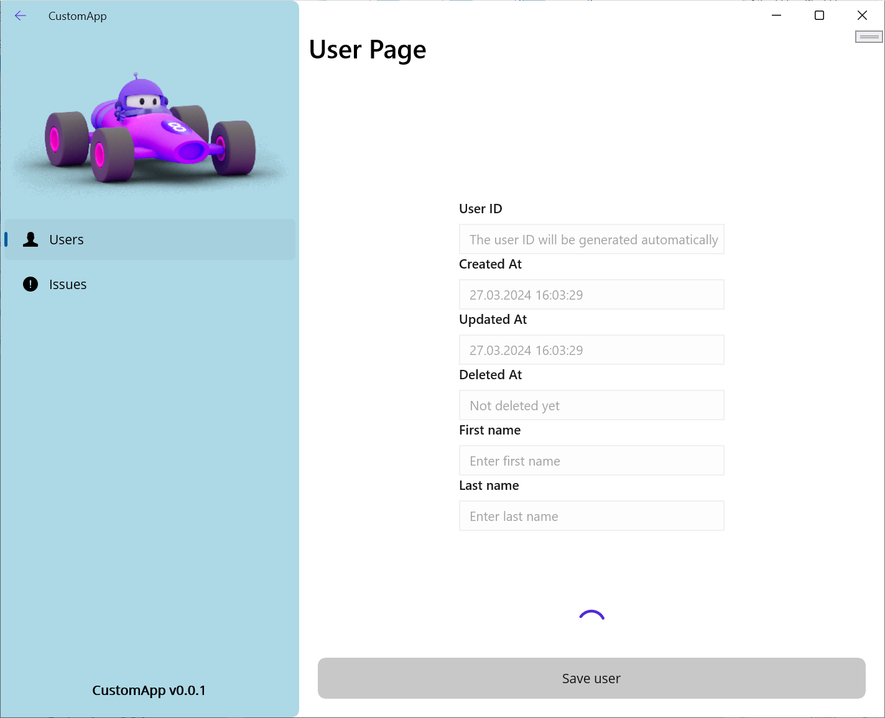

#### The user page in *load state*

When clicking the **save button** on the bottom of the page, the page turns into load state again.

In load state the name entry fields and the save button are **disabled** to prevent changes and re-clicking.

Furthermore, in load state an **activity indicator** is displayed between the data fields and the save button.

---

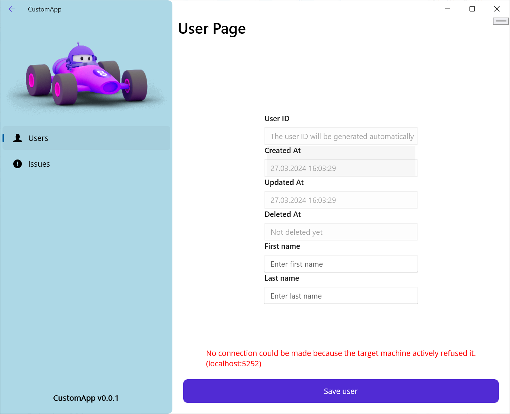

#### The user page in *error state*

Finally, the save action might fail again due to several reasons such as **backend connection errors**.

Consequently, the page turns into **error state** re-enabling the name entry fields and save button.

As before, also a **red-colored error message** is shown instead of the previous load indiciator.

---

#### The issues page

The issues page is almost equivalent to the **users page**, which has been explained previously.

The page consists of a reload button, an **issue list showing issue labels**, and a create button.

Finally, the page also distinguishes the **load and error states** with activity indicator and *optional* error message.

---

#### The issue page

When clicking an issue from the issues list or creating a new issue, you enter the so-called **issue page**.

The issue page is **intended to look like** a chat page from an instant messaging application.

However, the implementation of the page **was not finished** at the time of writing this deck.

---

<!-- _class: center -->

### Page models

The **data containers** for the previous pages.

---

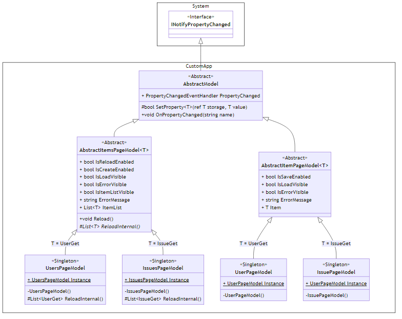

#### Page model overview

The diagram on the right shows the data models (or **page models**) underlying the previous pages.

At the top you find the **abstract page models** defining common fields, methods, and interfaces.

At the bottom you find the **concrete page models** inheriting from these abstract page models.

---

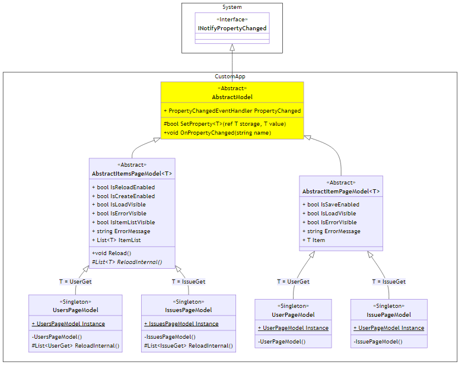

#### The `AbstractModel` class

The `AbstractModel` class froms the **root** of the page model inheritance hierarchy.

The class mainly provides a **generic implemenetation** of the interface `INotifyPropertyChanged`.

This interface must be implemented so that pages can **react to**  property changes automatically.

---

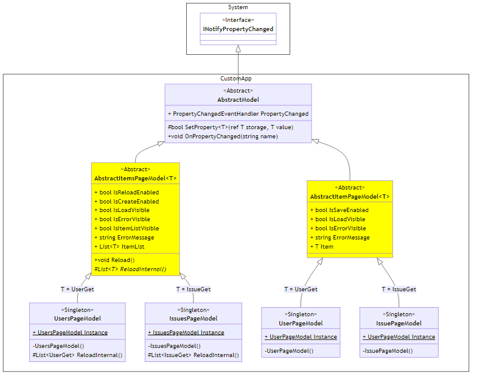

#### The generic item page models

From the abstract model we **derive** an `AbstractItemsPageModel` and an `AbstractItemPageModel` class.

The `AbstractItemsPageModel` class can be used for pages **loading and displaying item lists**.

The `AbstractItemPageModel` class can be used for pages **displaying and modifying single items**.

---

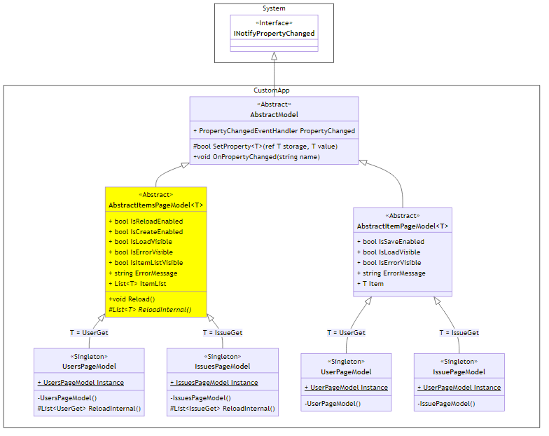

#### `AbstractItemsPageModel` class

The `AbstractItemsPageModel` class contains **boolean properties**  for hiding and disabling UI elements.

Then, the page model contains an **error string** property as well as an **items list** property.

Finally, the page model also contains a *public* `Reload` and a *protected abstract* `ReloadInternal` **method**.

---

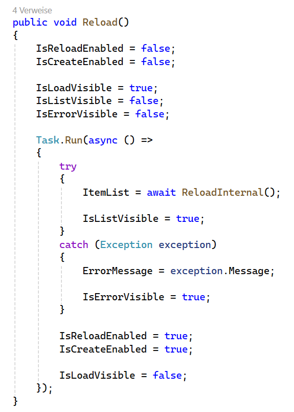

### The `Reload` method

The `Reload` method first **disables** buttons, **hides** list and the error, and **shows** the activity indicator.

Then, the **items** are loaded using the `ReloadInternal` or the **error message** is taken from an exception.

Finally, the buttons are **enabled**, the activity indicator is **hidden**, and the list or the error is **shown**.

---

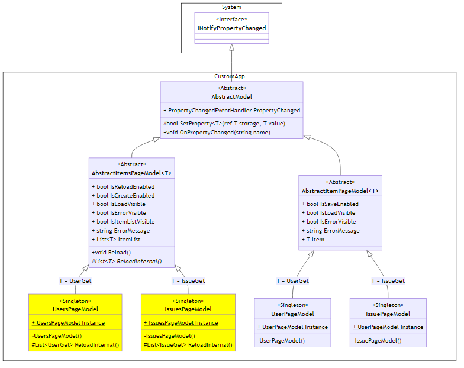

#### `Users-` and `IssuesPageModel`

Two **concrete items page models** exist, namely the `UsersPageModel` and the `IssuesPageModel` class.

The `UsersPageModel` class **manages** `UserGet` items, the `IssuesPageModel` **manages** `IssueGet` items instead.

Note that both models **implement** the singleton design pattern as well as the `ReloadInternal` method.

---

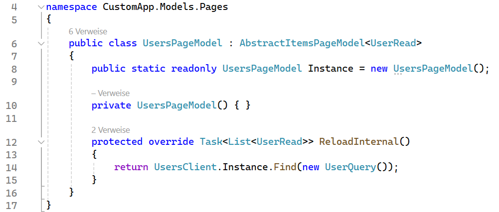

#### The `ReloadInternal` method

The screenshot on the right shows one **implemenation** of the method `ReloadInternal`.

Here, the `UsersPageModel` class uses the `UsersClient` **singleton instance** from the `CustomSdk` component.

Consequently, a reload causes an **HTTP message exchange** between GUI and backend services.

---

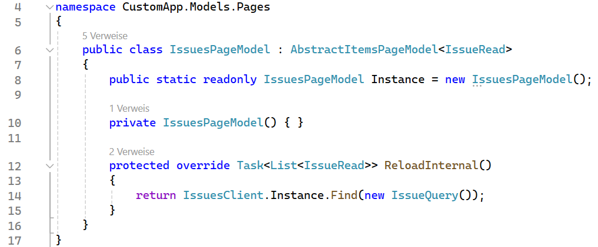

---

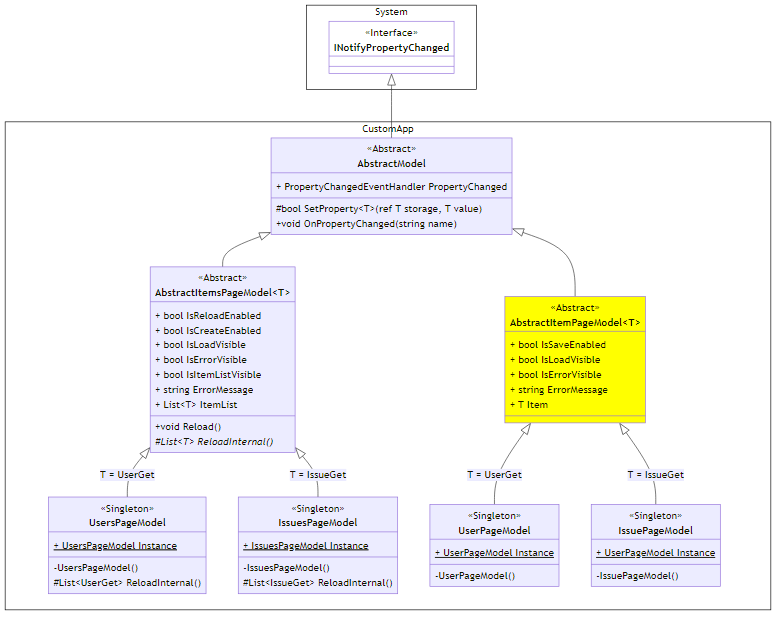

#### `AbstractItemPageModel` class

Similary, the `AbstractItemPageModel` class contains **boolean properties** for disabling and hiding UI elements.

Furthermore, the class contains an **error message** property as well as an **item** property.

For now, the class **does not contain** any methods, neither concrete nor abstract (*but might in the future*).

---

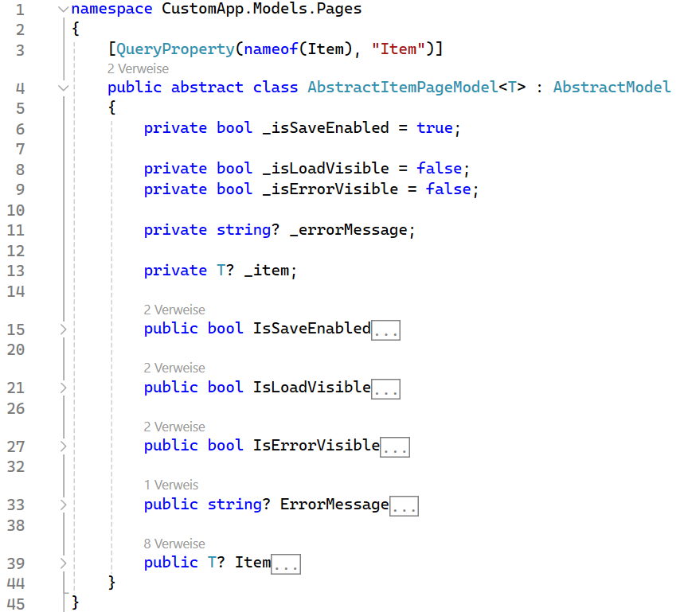

#### The `[QueryProperty]` annotation

Consequently, we assume that the item is **not loaded** from the backend via HTTP REST API call.

Instead the item **is passed** from the corresponding items page as *navigation parameter* (more later).

The navigation parameter is **bound to the item property** using the class-level `[QueryProperty]` annotation.

---

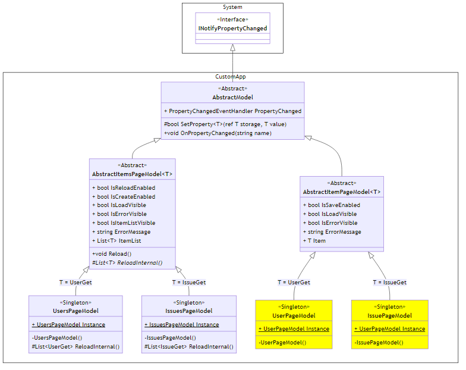

#### `User-` and `IssuePageModel`

Two **concrete item page models** exist, namely the `UserPageModel` and the `IssuePageModel` classes.

The `UserPageModel` class **manages** `UserGet` items, the `IssuePageModel` **manages** `IssueGet` items instead.

Both concrete item page models again implement the **singleton design pattern**.

---

<!-- _class: center -->

### Page controllers

Handling **user interaction** events.

---

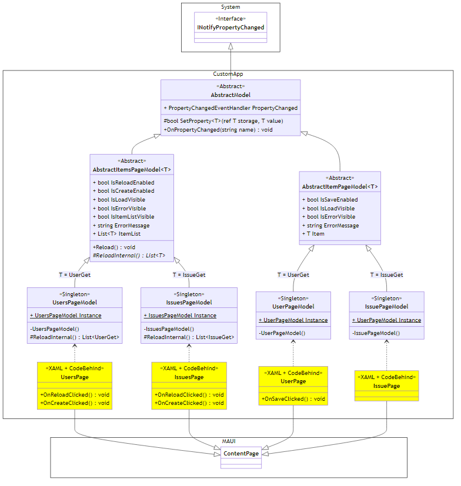

#### Page controller overview

The diagram on the right shows the **page (controller) classes** and their relation to the page model classes.

This time, for each page controller class the diagram also includes the **event handler method signatures**.

In the following, we explain each page controller class in greater detail including **constructors and methods**.

---

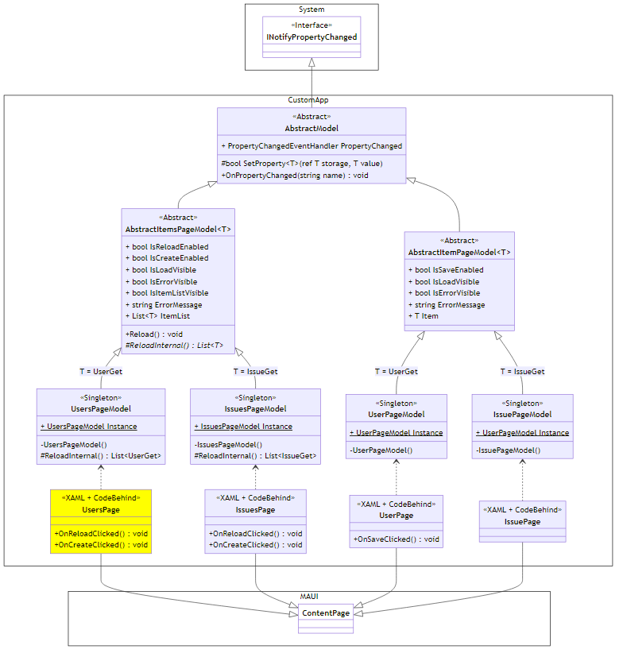

#### The users page controller

The users page controller class provides a **constructor**, as well as button and list **event handlers**.

The constructor is responsible for initializing the **UI elements** and setting up the **binding context**.

The event handlers are responsible for **reacting** to button click and list item select events.

---

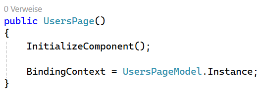

#### The constructor

The screenshot on the right shows the implemenetation of the `UsersPage` **constructor**.

First the constructor calls the `InitializeComponent` method, which is **generated** from the *XAML file*.

Then, the constructor sets the `BindingContext` **property** to the `UsersPageModel` singleton.

---

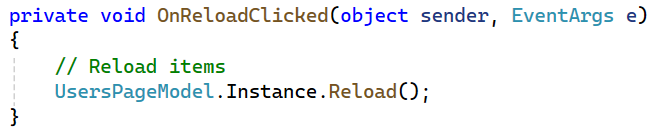

#### The `OnReloadClicked` method

The next screenshots shows the `OnReloadClicked` **event hanlder** implementation.

The event event handler is executed when the **reload button** on top of the page is clicked.

The handler **calls** the `Reload` method on the `UsersPageModel`, which has been explained before.

---

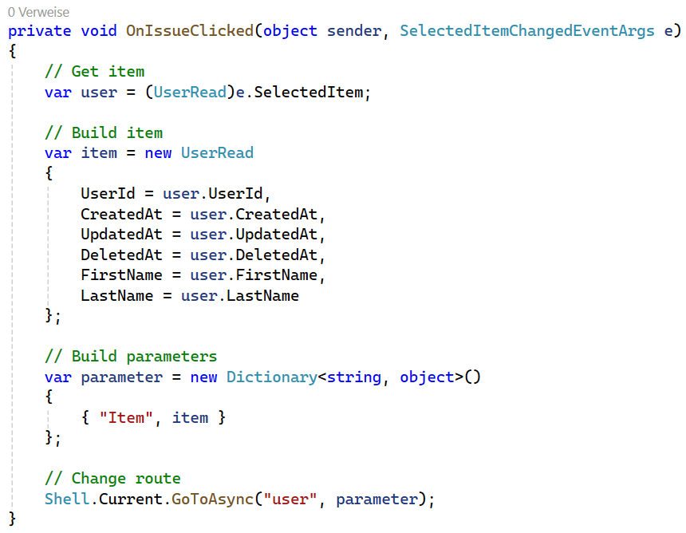

#### The `OnUserClicked` method

The `OnUserClicked` event handler is called when the user **changes the selected item** in the user list.

The event handler first **obtains and casts** the selected item before creating a **new copy**.

Then, the handler **navigates** to the **user page** and passes the copied item as a **parameter**.

---

#### The `OnCreateClicked` method

Finally, the `OnCreateClicked` event handler is called when the user clicks the **create butto**n on the bottom.

In contrast to the previous handler, this handler first creates an empty `UserGet` object.

Then, the handler issues the **same navigation request**, but passing the empty object as parameter.

---

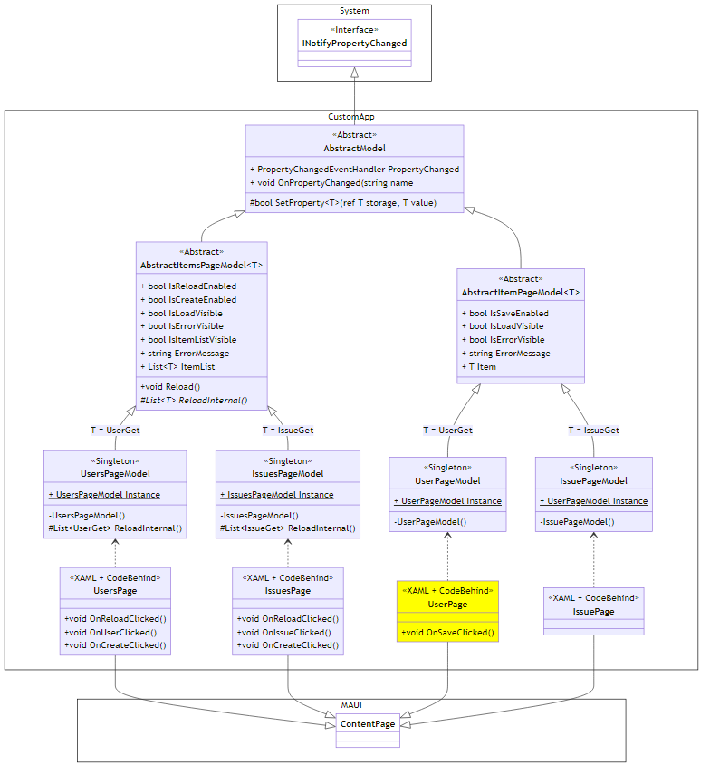

#### The user page controller

Upon the previous navigation requests, the `AppShell` switches from users page to **user page**.

The user page controller also includes a constructor for initializing **UI elements and bindings**.

Furthermore, the controller implements an **event handler** for when the **save button** is clicked

---

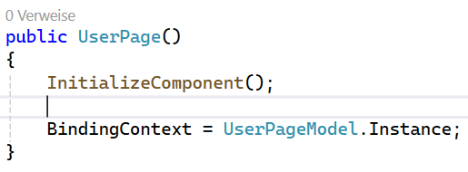

#### The constructor

The constructor is **very similar** to the constructor of the `UsersPage` page controller class.

Again, first the **auto-generated** `InitializeComponent` **method** is called to initialize the UI elements.

Then, the `BindingContext` **property** is set to the `UserPageModel` singleton instance.

---

#### Automatic parameter binding

Remember that the **underlying page model** has an `Item` property holding - here - a `UserGet` object.

Also remember that the `UserGet` object is **passed as a parameter** in the navigation request.

The class-level `[QueryProperty]` annotation **ensures** that the `Item` property **is bound to** the parameter.

---

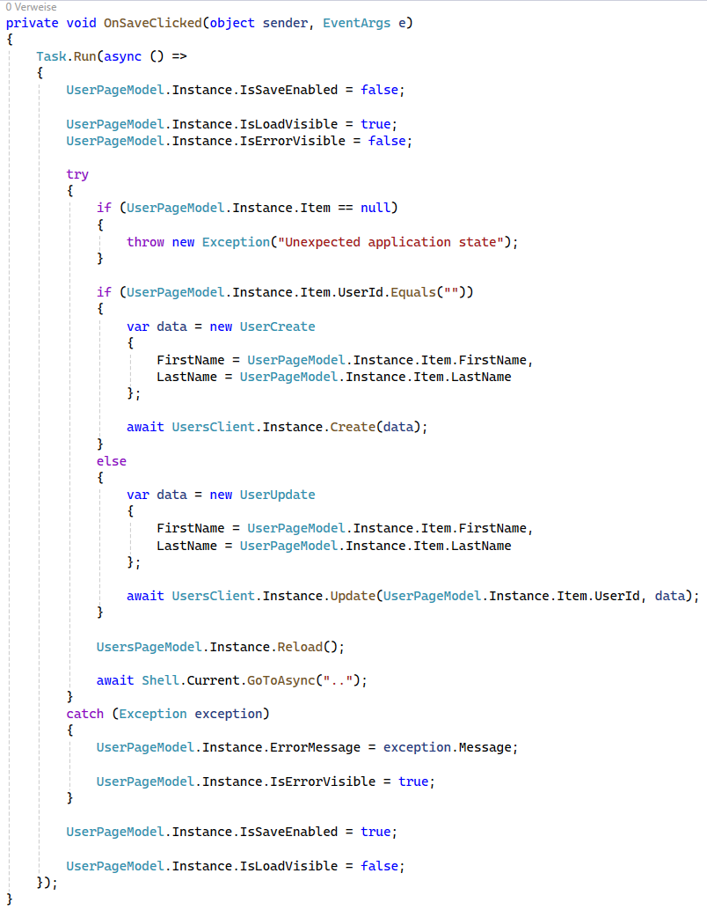

#### The `OnSaveClicked` method

The screenshot on the right shows in the **implementation** of the event handler `OnSaveClicked`.

Note that the event handler **works similar** than the `Reload` method of the `AbstractItemsPageModel` class.

Also note **how the handler decides** whether to call `Create` or `Update` on the *HTTP REST API client*.

---

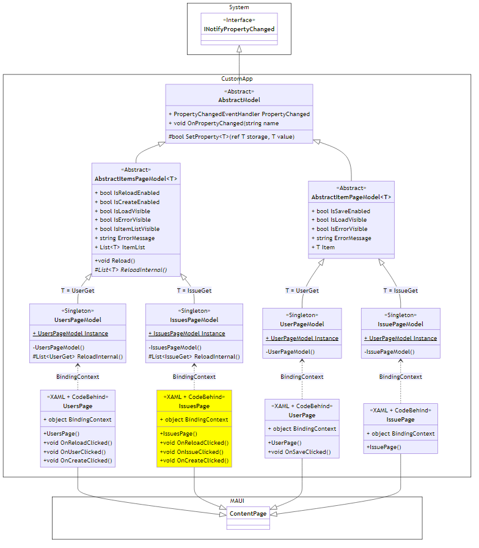

#### The issues page controller

The issues page controller class is **almost identical** to the users page controller class.

Again, the constructor initializes the **UI elements** and **binding context** property.

And the event handlers handle the reload and create **button clicks** as well as **list selection changes**.

---

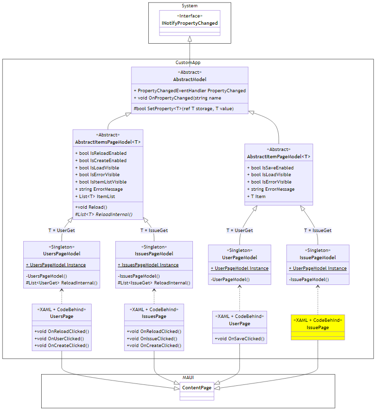

#### The issue page controller

Finally, the sample application **includes a stub** of the issue page controller class.

Note that at the time of writing this deck **we were missing** a proper implementation of the issue page.

However, this page is interesting because it shows a **mixture of issue item and comment items**.

---

<!-- _class: center dark -->

## Section 8 - Advanced topics

What else you could learn that we did not cover here.

---

### Advanced topic overview

There is much more you can learn about **mobile and cloud computing**. Here are some interesting topics you could study:

- **File transfer** is required to share regular files via HTTP REST APIs
- **User authentication** is required to personalize the user experience
- **Request authorization** is required to enforce user-specific permissions
- **Database integration** is required to benefit from database technologies
- **Live synchronization** is required to enable real-time user collaboration
- **Offline caching** is required to provide the functionalities while offline
- **Application scaling** is required to support large user communities

---

<!-- _class: center dark -->

## You are ready to code 👩‍💻

Well done!
