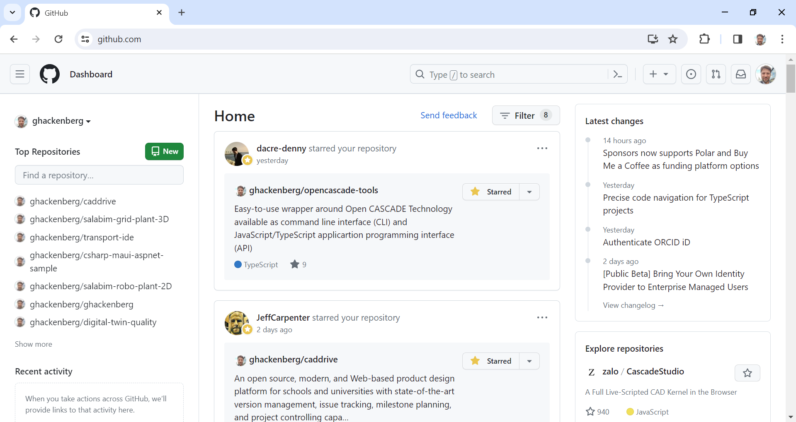
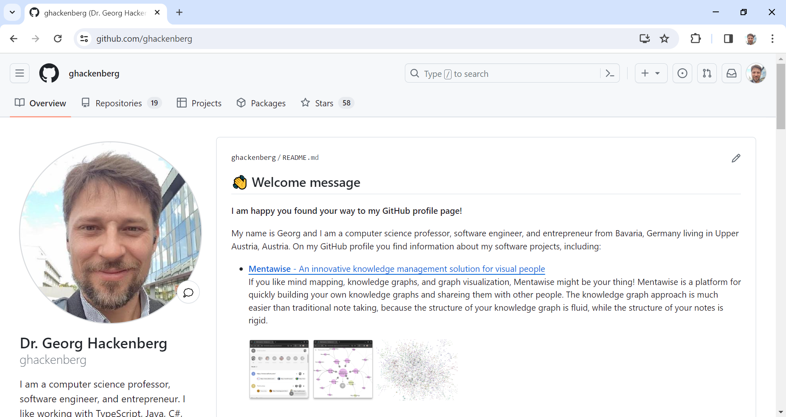
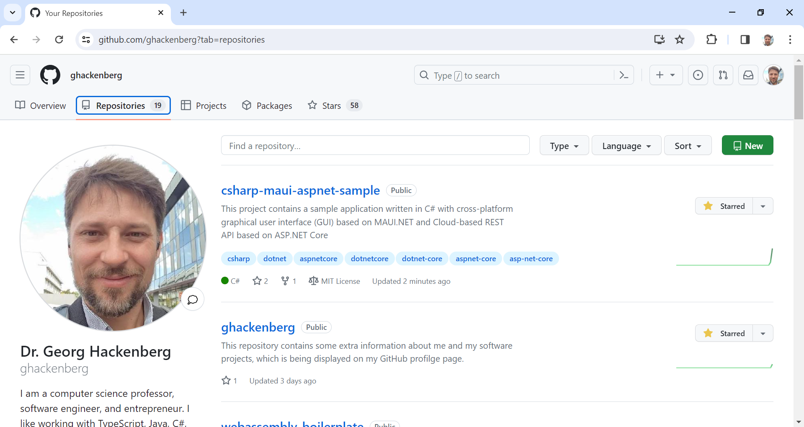

# Guide 1 - Create and explore your personal GitHub account

To start working on the project and keeping your change history, you first need to fork this GitHub project. And in order to fork this GitHub project, you need to create your own GitHub account.

## Previous steps

Nothing to do before! 😀

## ``Step 1.1`` - Start registration

To create you personal GitHub account, you need to go the [GitHub start page](http://github.com) and run through the sign up process. You can sign up with GitHub for free, so no credit card is required. However, free accounts are mostly meant for open source software projects. If you want to work on closed source software instead, you need to choose a paid account.

## ``Step 1.2`` - Pick username

During the sign up process, you must pick your GitHub username, which defines your identity on GitHub. All your open source software projects will include your GitHub username in their name (unless you create separate organisations and associate your projects with those organisations). Therefore, choose your GitHub profile name wisely! 😉

## ``Step 1.3`` - Visit dashboard

After registering, your the GitHub start page at https://github.com turns into your personal GitHub dashboard. On the left side of the dashboard, you see your top repositories based on the changes that you made recently to the source code. In the middle, you find information about the latest commits to GitHub repositories, which you are watching (more about watching repositories later!). Finally, on the right side you find the latest news from the GitHub organization.

## ``Step 1.4`` - Visit profile

Then, you can visit and edit your GitHub profile page. Your GitHub profile page is visible to all other users of GitHub. So be careful what you write there! Use your profile page as a marketing instrument. Provide some information about your professional (and maybe personal) interests and link other social media accouts such as [LinkedIn](https://linkedin.com) and [YouTube](https://youtube.com). Your profile page should help you building your reputation as a software developer in the open source community.

## ``Step 1.5`` - Visit repositories

The profile page also includes a repositories tab. Under the repositories tab you find all the GitHub repositories, which are associated with your GitHub account. For each repository, the repository name, a repository description, the repository keyword, the main programming language used in the source code, the number of repository stars and forks, and information about the source code license are provided. You also can use the repositories tab to create a new GitHub repository and start working on another awesome software project!

## Next steps

[Guide 2 - Create a fork of the original Git repository](../1_Fork/README.md)