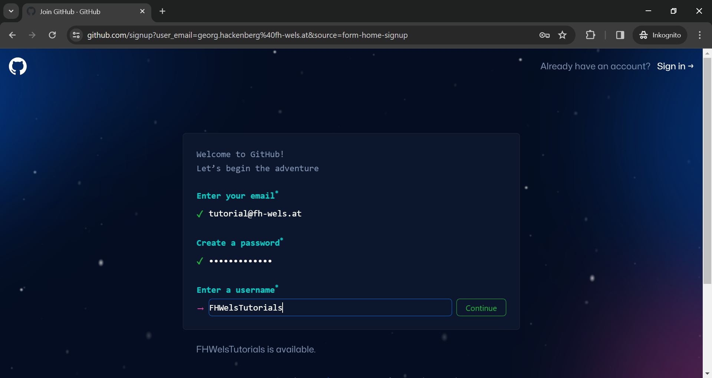

# Step 1 - Create your personal GitHub account

To start working on the project and keeping your change history, you first need to fork this GitHub project. And in order to fork this GitHub project, you need to create your own GitHub account.

## ``Step 1.1`` - Start registration

To create you personal GitHub account, you need to go the [GitHub start page](http://github.com) and run through the sign up process. You can sign up with GitHub for free, so no credit card is required. However, free accounts are mostly meant for open source software projects. If you want to work on closed source software instead, you need to choose a paid account.

## ``Step 1.2`` - Pick username

During the sign up process, you must pick your GitHub username, which defines your identity on GitHub. All your open source software projects will include your GitHub username in their name (unless you create separate organisations and associate your projects with those organisations). Therefore, choose your GitHub profile name wisely! 😉

