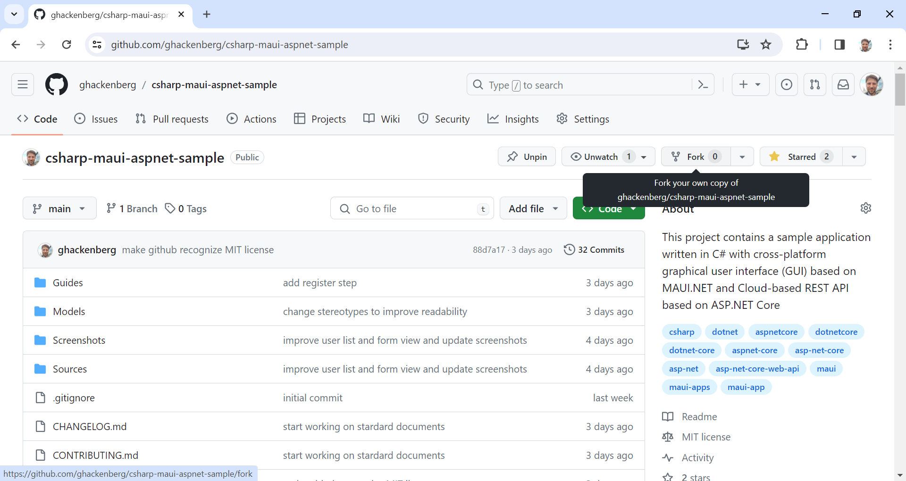
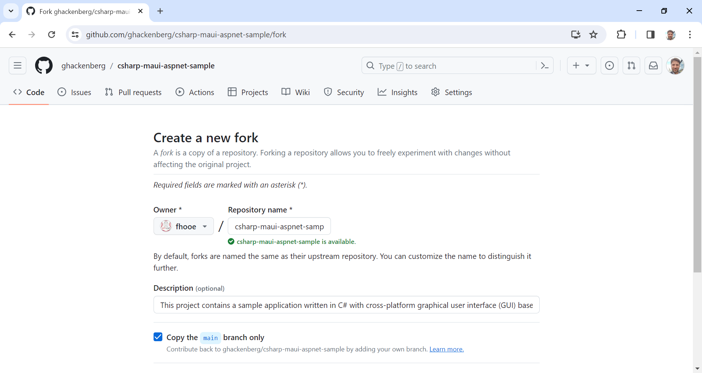
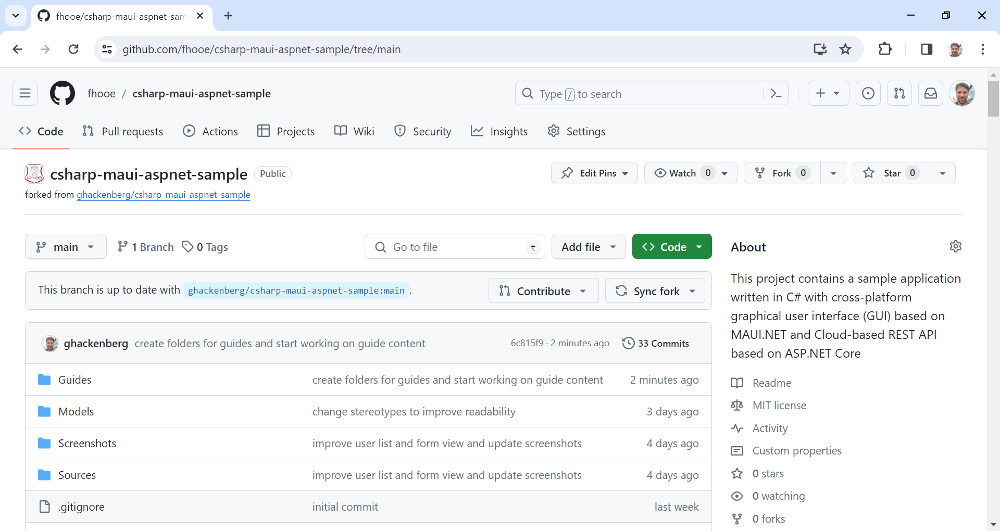
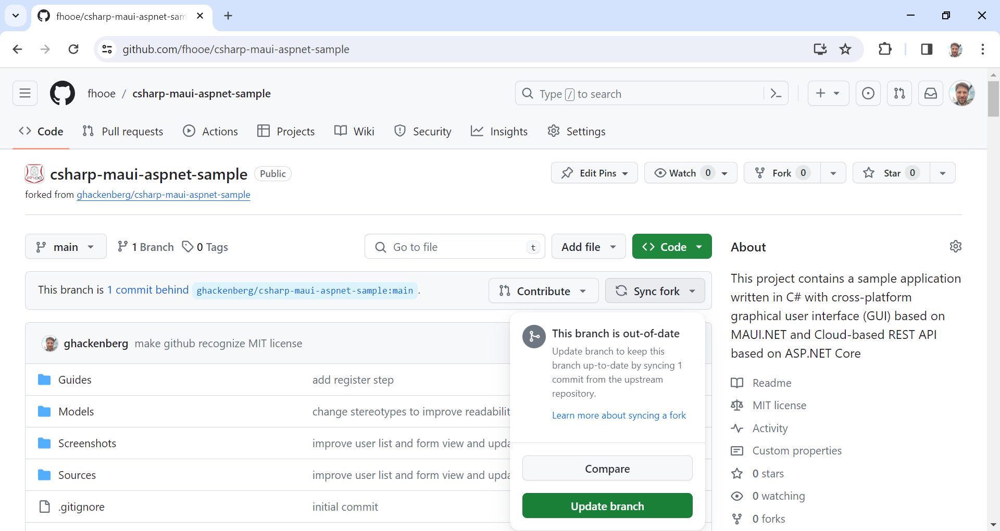

# Guide 2 - Fork the repository of the sample application

After having [created your personal GitHub account](../0_Register/README.md), you can proceed with forking this GitHub repository. Forking means creating your own independent copy of the original copy. Afterwards, you can work on your independent copy without messing with the original repository behind. Forking is a common approach for building on the work of other open source software developers.

## Previous steps

[Guide 1 - Create your personal GitHub account](../0_Register/README.md)

## ``Step 2.1`` - Vist original repository

To fork this GitHub repository, you need to go to its main page, which you find under https://github.com/ghackenberg/csharp-maui-aspnet-sample. The main page of a GitHub repository is the entry point for project owners and software developers alike. On the main page, you find different information such as the number of commits to the repository, the contributors to the repository, and much more. On the top right of the main page, you should also see a *fork button*. Click the button to configure your personal fork of the original GitHub repository.

## ``Step 2.2`` - Fork original repository 

When forking a GitHub repository, you can choose the name of the forked repository. Typically, you use the name of the original repository also for the forked repository. However, you also can choose to use a different name for the fork. Furhermore, you can change the description of the forked repository. Finally, you can choose whether only the main branch of the original repository is copied, or whether all branches (also dev branches) should be copied. In this tutorial it is fine to copy only the main branch.

## ``Step 2.3`` - Visit forked repository

After finishing the forking process, you should see a copy of the original GitHub repository under your own account and username. On the main page of your repository fork, you find the name your fork as well as a link to the original repository under the fork name. Furthermore, the main page shows you whether your fork is up-to-date, ahead, or behind with respect to the original repository. Immediately after forking, your repository fork should be up-to-date, but that will change while software development progresses.

## ``Step 2.4`` - Update forked repository

From here on, the fork is detached from the original repository, i.e. changes to the original repository are *not* reflected on the fork automatically. However, GitHub provides you with information on how many changes have been made to the original repository since forking it. Also, Github provides the means for merging these changes into your fork. The merging process can be done fully automatically, if you do your changes in a separate branch and do not touch the branches of the original repository.

## Next steps

[Guide 3 - Install Microsoft Visual Studio on your computer](../2_Prepare/README.md)