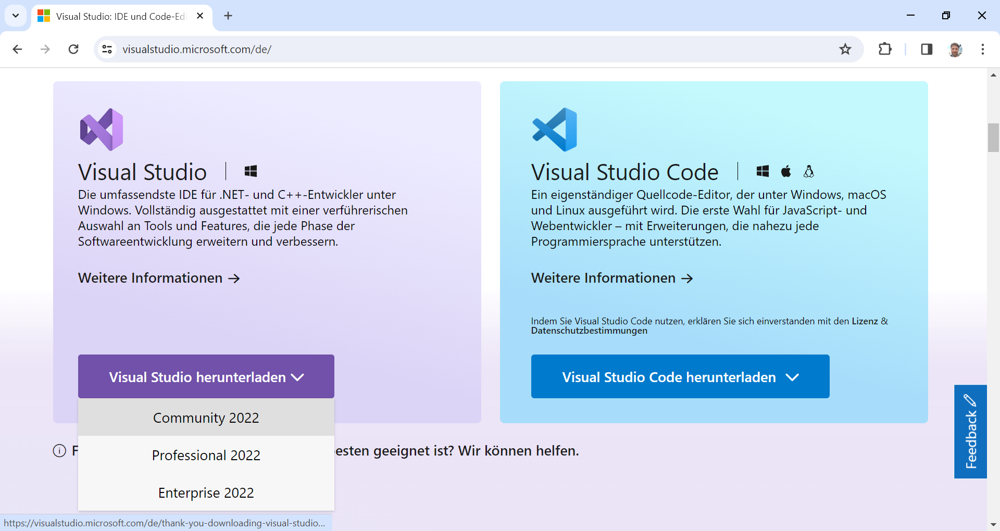
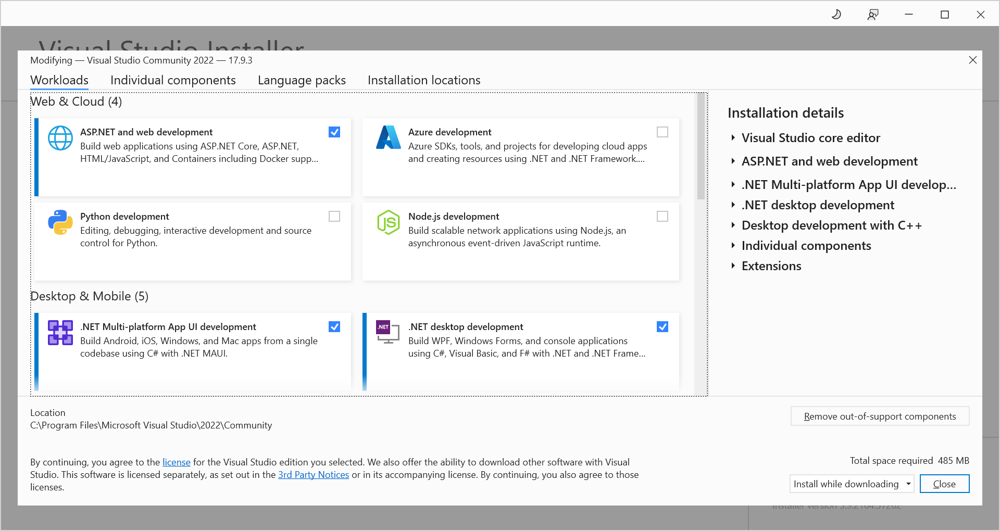
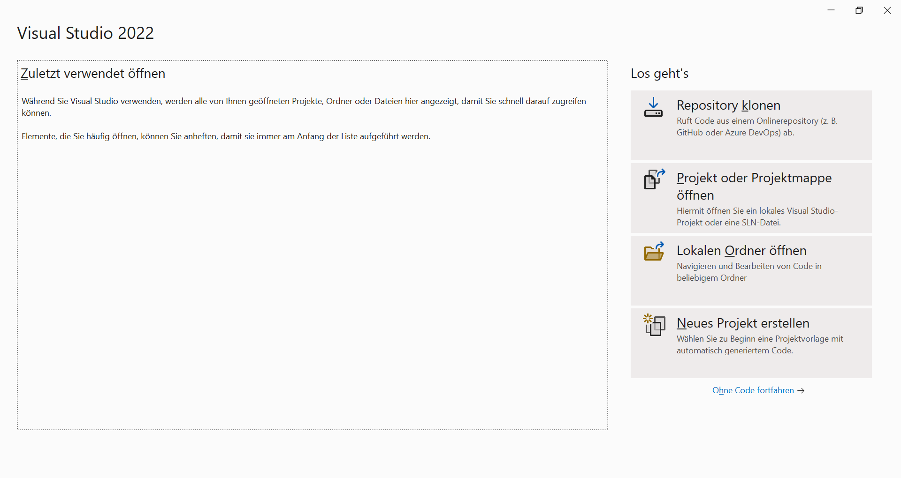

# Guide 3 - Prepare your development environment

After creating your personal GitHub account and forking this GitHub repository, you can proceed with setting up your local software development environment. Fortunately, setting up the development environment is rather easy: You only need to instance **Microsoft Visual Studio 2022 Community Edition** including the workloads for MAUI.NET and ASP.NET deveopment.

## Previous steps

[Guide 2 - Fork the original Git repository](../1_Fork/README.md)

## ``Step 3.1`` - Download installer

To start the installation process, go to the [Microsoft Visual Studio website](https://visualstudio.microsoft.com/) and download the installer for the Community Edition of Visual Studio 2022. Note that Visual Studio 2022 is a professional software development environment from Microsoft. Furhtermore, the Community Edition of Visual Studio 2022 is a **free version** of the environment for small and open source software projects.

## ``Step 3.2`` - Run installer

After the installer has been downloaded, start the installation executable and proceed until the workload selection appear. In the workload selection screen, selected the **MAUI.NET and ASP.NET workloads** as depicted in the following screenshot. These two workloads are required in order to load, build, and run the sample project successfully on your local computer.

## ``Step 3.3`` - Verify environment

Finally, after installing Visual Studio including the MAUI.NET and ASP.NET workloads, you can start the environment and very it works as expected. When starting Visual Studio, you should first see a purple splash screen, before the welcome screen appears. The welcome screen shows the software projects, which you have been working on recently, and allows you to open them.

## Next steps

[Guide 4 - Clone the Git repository with Microsoft Visual Studio](../3_Clone/README.md)