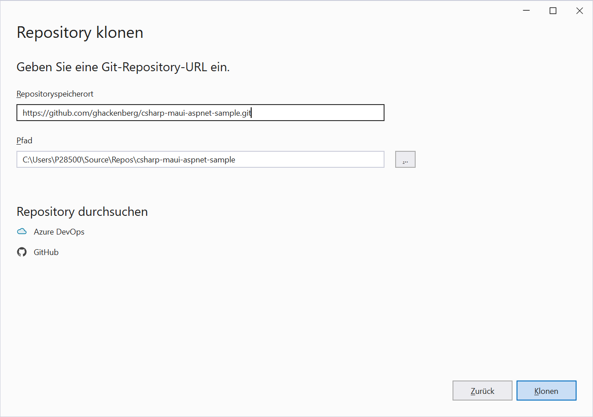

# Guide 4 - Obtain the sources of the sample application

In this guide you learn how to clone a Git repository with Visual Studio. In the Git world, cloning means creating a copy of the repository on your local machine. Software engineers typically work on local copies of the source code before committing and pushing changes to the shared remote repository (more about that later!).

## Previous steps

[Guide 3 - Install Microsoft Visual Studio on your computer](../2_Prepare/README.md)

## ``Step 4.1`` - Access GitHub repository page

When you want to clone a Git repository from [GitHub.com](https://github.com), you should open your browser and navigate to the repository page first. In our case, the original repository can be found at https://github.com/ghackenberg/csharp-maui-aspnet-sample. If you created a fork of the original repository, you should use the URL of the fork instead.

TODO Screenshot

## ``Step 4.2`` - Obtain Git repository URL

On the GitHub repository page, you find a green button for cloning the repository. When clicking on the button, you are shown a number of options for creating a clone: Either you can use the SSH protocol for downloading the repository files, or you can use the HTTPS protocol (which is slightly slower but easier to configure). Finally, you also have the option to download the latest source code as ZIP archive. Here we will choose the HTTPS option for its simplicity.

TODO Screenshot

## ``Step 4.3`` - Enter Visual Studio clone screen

After copying the HTTPS protocol URL from the GitHub repository page, it is time to start Visual Studio on your local machine. When starting Visual Studio a welcome screen is shown, which shows the latest projects you have been working on and allows you to start new projects. On the top right the welcome screen provides a button for cloning repository, which you should click now.

## ``Step 4.4`` - Enter Git repository URL

After clicking the repository clone button on the welcome screen, a mask is shown for entering the URL of the Git repository which you would like to clone. Paste the URL of the Git repository here, which you took in a previous step from the GitHub repository page. Then choose the folder where the local copy of the repository should be placed and hit the clone button on the bottom of th screen.

## ``Step 4.5`` - Pick Visual Studio solution file

TODO Content

## Next steps

[Guide 5 - Compile and run the sample in Microsoft Visual Studio](../4_Run/README.md)