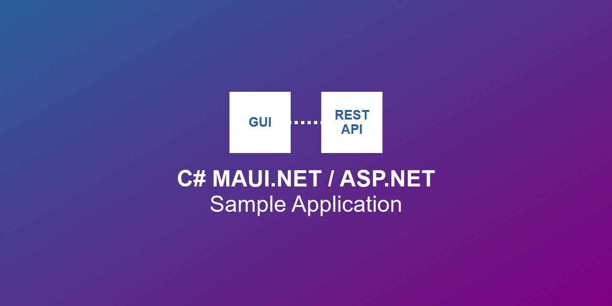

<!-- _class: title -->

# Short introduction to the C# MAUI.NET / ASP.NET Sample Application

**Dr. Georg Hackenberg BSc MSc**

Professor for Industrial Informatics | School of Engineering
University of Applied Sciences Upper Austria
Stelzhamerstr. 23, 4600 Wels, Austria

👤 https://github.com/ghackenberg
👤 https://linkedin.com/in/georghackenberg
👤 https://youtube.com/@georghackenberg

Also check out 🌐 https://mentawise.com and 🌐 https://caddrive.org 😎

---

## Content overview

This presentation provides a **starting point** for working with the **C# MAUI.NET / ASP.NET Sample Application** and is divided into two main sections:

- **Section 1 - External interfaces** explaining the graphical user interface (GUI) and the underlying REST API
- **Section 2 - Internal structures** explaining the structure of the source code in the background

---

<!-- _class: section -->

## Section 1 - External interfaces

**MAUI.NET frontend** and **ASP.NET backend**

---

### MAUI.NET frontend

The C# MAUI.NET / ASP.NET Sample Application features a **basic** graphical user interface (GUI).

With the GUI you can manage the **users** and the **issues** stored in the underlying database.

The screenshot on the right shows the **users page** listing all created user entities.

---

### MAUI.NET frontend (cont'd)

*Coming soon*

---

### ASP.NET backend

*Coming soon*

---

<!-- _class: section -->

## Section 2 - Internal structures

**Package**, **data**, **message**, **interface**, and **page structure**

---

### Package structure

*Coming soon*

---

### Data structure

*Coming soon*

---

### Message structure

*Coming soon*

---

### Interface structure

*Coming soon*

---

### Page structure

*Coming soon*

---

<!-- _class: section -->

## Now you can start coding 👩‍💻

Well done!