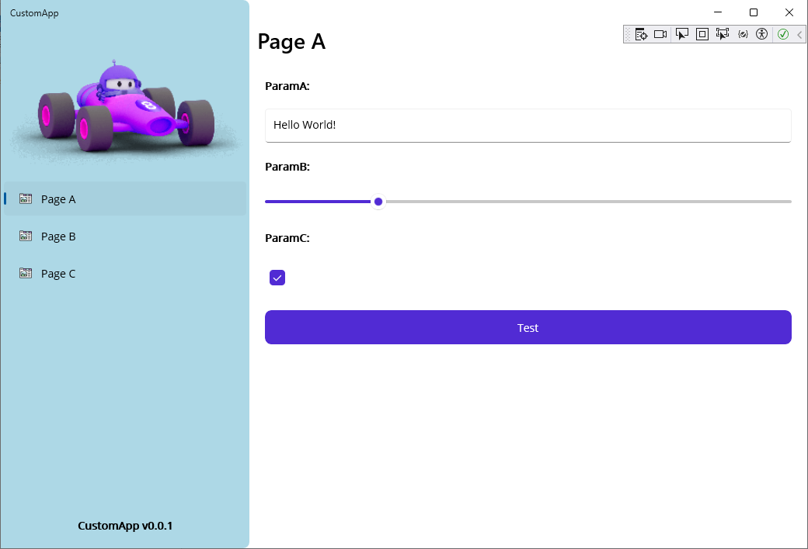

# CSharp .NET MAUI / ASP.NET Sample

This project contains a **Sample Application** based on the awesome **.NET MAUI** and **ASP.NET** frameworks. Note that .NET MAUI allows you to build cross-platfrom graphical user interfaces, while ASP.NET supports you in building Cloud services. Here is a screenshot of the graphical user interface of this sample application:

## Software architecture

In the following, we explain the software architecture of the sample application. We divided the expanation into the following subsections:

1. **Package structure** describes the C# packages (i.e. DLLs and EXEs) and their relations.
2. **Data structure** describes the database entities, their attributes, and their relations.

Read more below.

### Package structure

The following diagram explains the package structure of the sample application. The package structure consists of three projects: A .NET MAUI application project, an ASP.NET werb service project, and a common class library project. Furthermore, the .NET MAUI application communicates with the ASP.NET web service via HTTP REST protocol.

### Data structure

The following diagram explains the data structrure of the sample application: The data structure consists of three classes: A user class representing the users of the application, an issue class representing the issues created by the users, and a comment class representing comments created by the users and contained in issues.

