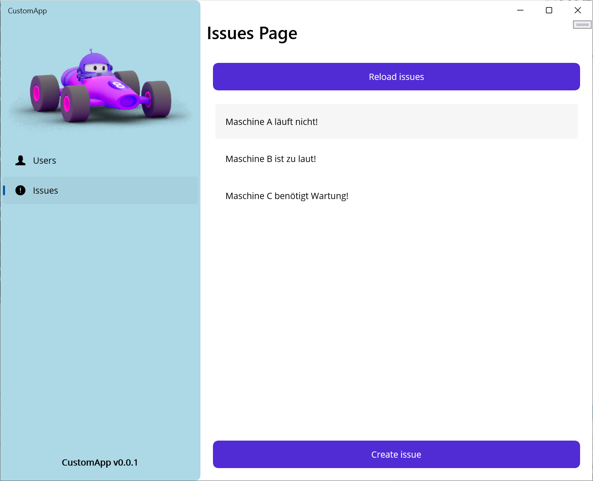
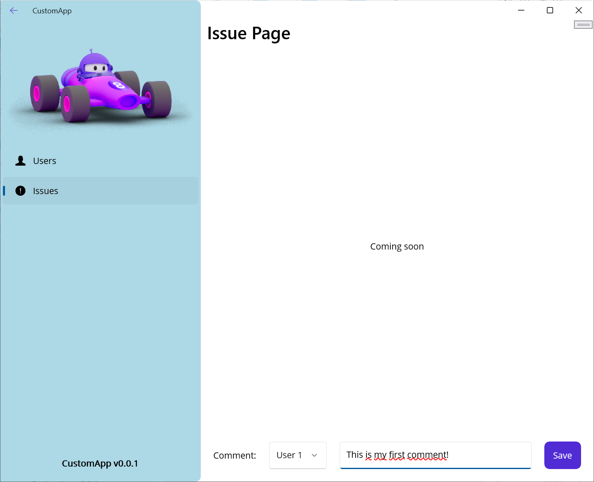

# C# MAUI.NET / ASP.NET Sample

**This project contains a sample application based on the awesome Microsoft MAUI.NET and ASP.NET frameworks.**

We use this sample project at the [School of Engineering](https://www.fh-ooe.at/campus-wels/) of the [University of Applied Sciences Upper Austria](https://www.fh-ooe.at/) in [Wels, Austria](https://www.wels.at/) for teaching courses in **Mobile and Cloud Computing** to our engineering and management students. Since we mainly use C# as a language and DotNet as a framework in our programming courses in the earlier semester, we decided to use the  MAUI.NET and ASP.NET frameworks in this course. The MAUI.NET and ASP.NET frameworks provide the following capabilities:

- [MAUI.NET](https://dotnet.microsoft.com/en-us/apps/maui) supports building **cross-platfrom graphical user interfaces (GUIs)**.
- [ASP.NET](https://dotnet.microsoft.com/en-us/apps/aspnet) supports building **Cloud services with state-of-the-art REST APIs**.

## 📦 Packages

The following diagram explains the **package structure** of the sample application:

Each package in this structure serves a different **purpose**:

- The `CustomLib` package provides **common classes and interfaces** to the other packages and, hence, forms a contract between them.
- The `CustomApi` package provides a **HTTP REST API server implementation** with in-memory data store based on the Microsoft ASP.NET framework.
- The `CustomSdk` package provides a **HTTP REST API client implementation** for the two frontend applications as well as third party software.
- The `CustomCli` package provides a **Command Line Interfaces (CLI)** for sending requests to the HTTP REST API and printing responses.
- The `CustomApp` package provides a **Graphical User Interface (GUI)** based on the cross-platform Microsoft MAUI.NET framework.

Note that we have used similar package structures for production-grade applications in the past. Hence, this package structure also represents a *best practice recommendation* that you are free to reuse at your own risk!

*If you want to know more about this, we suggest diving into the code!* 👩‍💻😉

## 📝 Guides

The following set of guides helps you **getting started with MAUI.NET and ASP.NET development on your local machine**. Note that the guides have been prepared for Windows machines only. In principle, MAUI.NET and ASP.NET development should be possible also on OS X and Linux machines. However, we did not test that!

- [**Guide 1 - Create your personal GitHub account**](./Guides/0_Register/README.md)
- [**Guide 2 - Fork the respository** of the sample application](./Guides/1_Fork/README.md)
- [**Guide 3 - Prepare your development environment**](./Guides/2_Prepare/README.md)
- [**Guide 4 - Clone the sources** of the sample application](./Guides/3_Clone/README.md)
- [**Guide 5 - Build and run** the sample application](./Guides/4_Run/README.md)
- [**Guide 6 - Make changes** to the sample application](./Guides/5_Change/README.md)

## 📸 Screenshots

In the following, we provide screenshots of the sample application to give a first impression of its functionality. The following screenshots are included:

1. **MAUI.NET Users Page** provides a list of existing users
2. **MAUI.NET User Page** provides details of one user
3. **MAUI.NET Issues Page** provides a list of existing issues
4. **MAUI.NET Issue Page** provides details of one issue
5. **ASP.NET Swagger UI** provides the REST API documentation

### MAUI.NET Users Page

The **MAUI.NET Users Page** provides a list of existing users, allows you to reload the list of existing users, and provides means for editing existing users or creating new users. The users are retrieved from the backend service.

### MAUI.NET User Page

The **MAUI.NET User Page** provides means for editing the information of existing users or entering the information of new users and sending the information to the Cloud-based backend services for long-term storage.

### MAUI.NET Issues Page

The **MAUI.NET Issues Page** provides a list of existing issues, allows you to reload the list of existing issues, and provides means for editing existing issues or creating new issues. The issues are retrieved from the backend service.

### MAUI.NET Issue Page

The **MAUI.NET Issue Page** provides means for editing the information of existing issues or entering the information of new issues and sending the information to the Cloud-based backend services for long-term storage.

### ASP.NET Swagger UI

The **ASP.NET Swagger UI** provides a documentation of the Cloud-based backend services, which are exposed via HTTP REST API. For each endpoint, the expected inputs and provided outputs are shown including examples.

## 📜 Documents

As for every open source project, we provide **three standard documents**: The license agreement for using the source code, rules for contributing to the source code of the project, and a change log summarizing relevant changes to the source code:

- [License](./LICENSE.md)
- [Contributing](./CONTRIBUTING.md)
- [Changelog](./CHANGELOG.md)